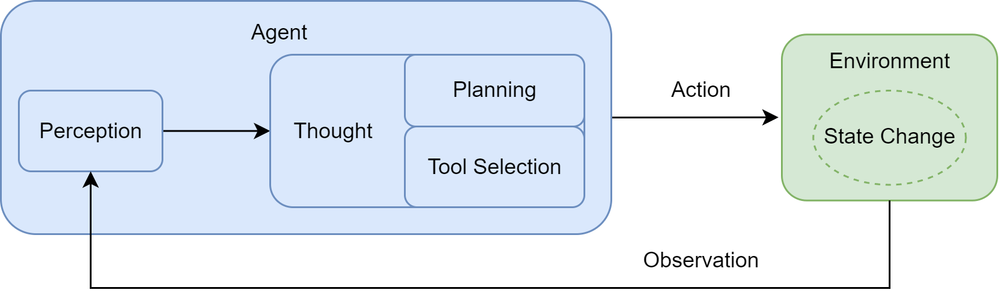
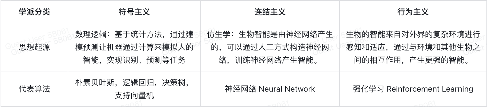

总而言之，我们正从开发专用自动化工具转向构建能自主解决问题的系统。核心不再是编写代码，而是引导一个通用的“大脑”去规划、行动和学习


## Agent的机制

Agent loop: 



- 感知，接收环境带来的信息（观察）
- 思考
  - 规划
  - 工具选择
- 行动

智能体的行动会使环境的状态发生变化，产生新的观察。期间交互的协议是一种结构化的json文件，thought和action之间，通过外部的解析器parser捕捉thought生成的指令，并调用相应的函数。

即`Thought-Action-Observation` 交互范式


# 智能体发展史

基于符号与逻辑（逻辑推理机）-->基于规则的聊天机器人-->范式的学习（模式识别）与现代智能体



模式识别-联结主义范式：

- 知识的分布式表示，相互连接构成的网络，形成知识
- 简单的处理单元，加权输出

- 通过学习调整权重

```markdown
算法之一：
梯度下降
```

