# C++复习（入门）

EE538, Instructor: Arash Saifhashemi

USC, Viterbi school of Engineering, Electrical and Computer Engineering

暂不涉及继承，多态，虚函数等。

除C++外，包含一些基础的数据结构（以及STL的用法），基础的算法思想。

## Instruction

C++基础
- 语法

软件工程基础
- 测试、Source Control, Shell scripts
- 动态编程
- OOP

算法与数据结构基础
- 树、链表、哈希、堆...
- 时间复杂度分析
- 算法：贪心，recursion递归，动态规划...

## Programmer Basic Tools

注册Stackoverflow 账号

注册Github账号

- VS Code
- Git
- Linux-compatible terminal
- C++ Toolchain 
  - Mac: Xcode + Bazel
  - Windows: Cywin or MinGW
  - Linux: GCC + Bazel

## C++的设计理念和特性

快，不像python或java一样在运行代码的时候，编译器像个保姆，内置了很多检查机制。而C++更像“程序员知道自己在做什么”。

“You only pay for what you use”

C++的灵魂，是如果你不需要某个功能（比如安全检查），你就不用为它付出性能代价。

例如：
如果一个数组的大小是10，我们试图访问第100个元素，Python会抛出IndexError并停止运行。C++会直接去内存中偏移量为100的位置读写数据。这样会导致：
- 那块内存正好没有被使用，程序看起来正常
- 那块内存存折系统关键指令，修改后导致程序崩溃
- 其他变量的值被修改，导致出现难以排查的逻辑错误

但是现在比较新的C++，很大程度上规避了这些风险，虽然仍然存在，但是可以让C++具有高性能的同时，获得了更高的安全性。

## 编译器

.h file: Only the declarations

.cc/cpp file: Implementations  **--compile-->** .o file **-->** executable

## 关于写码

Find corner cases 边界问题
Pseudo-Code 伪代码

规范的步骤：

1. 仔细分析问题，细节考虑
2. 边界问题的考虑
3. 写出算法的outline（可能有很多种思路）
   1. 对比性能，谁更快，更高效
4. 实现
5. 测试
6. 验证代码的正确性
   1. Induction 数学归纳法
   2. Contradiction 反证法
   3. Case Analysis 分类讨论
   4. Other techniques

### Induction

数学归纳法：k = 1时成立，如果 k 时成立，推导对于k+1也成立

### Unit Tests

- A unit test is a piece of code that tests a function or a class
-  Unit tests are written by the developer

### Version Control

Who, what, where, when, why

#### Git

- Modified: 只是修改，还没有提交到仓库
- staged: 已经在当前版本中标记了已修改的文件，以便将其放入下次提交快照(snapshot)中
- Committed: 数据已经安全保存到数据库

### Runtime Analysis

- Count the number of elementary operations instead of timing them.

- Consider the Worst Case. Make the runtime a function of the size of the input. It is just an estimate.

时间复杂度的计算：


## C++语法

overloaded重载

### 操作符


其中，Bitwise operators的用法是：


### 数据类型

Primary

- int
- char
- bool
- float
- double
- void

Derived

- array
- pointer
- References

User Defined

- struct
- class
- union
- enum
- typedef

Variables and Modifiers

- signed
- unsigned 
- long
- short

**各种数据类型的bytes，bits长度**


#### enum

enum class更规范

```c++
// Enum type in C:
enum ColorPallet1 { Red, Green, Blue };
enum ColorPallet2 { Yellow, Orange, Red };

// Enum Class in C++
// Declaration
enum class ColorPalletClass1 { Red, Green, Blue };
enum class ColorPalletClass2 { Yellow, Orange, Red };

// Assignment
ColorPalletClass1 col1 = ColorPalletClass1::Red;
ColorPalletClass2 col2 = ColorPalletClass2::Red;
```

#### auto

```c++
for (auto n : my_vector){
  std::cout<< n;
}
```

#### **Pointers**

```c++
int a = 1;
int* pp = &a;
int** r = &pp;
std::cout << "r: " << r << std::endl;
std::cout << "*r: " << *r << std::endl;
std::cout << "**r: " << **r << std::endl;
// 如果写
int* r = &pp;
//会报错，因为&pp的类型是int**，而定义的r是int*
//int* r 和 int *r 的两种写法是等价的，最好固定一种写法
//另外，在定义时不要写成
int* p,q; //这实际上定义的是一个指针p和一个整型q, 另外，指针定义的时候，要初始化：int* p = nullptr
```

Pointer : new and delete

使用的是堆heap，动态内存分配

```c++
int i = 5;
int* p = new int;
p = &i; //上面定义new int的地址就已经丢失了 
delete p;// 忘记delete会导致内存泄漏
```

一般来讲，引用比指针更加的安全

#### **References**

```c++
int i = 10;
int& j = i;
j++;
```

Passing parameters

参数传递要用指针或引用，用变量本身只是临时复制了一个函数内的变量，不会改变外部的值

```c++
int main() {
  std::vector<int> my_vector = {1, 2, 3, 4, 5, 6, 7, 8};
  for (auto n : my_vector) {
    n++;
  }
  // What is the value of my_vector? 不变
  for (auto &n : my_vector) {
    n *= 10;
  }
  //{10, 20, 30, 40, 50, 60, 70, 80}
  return 0;
}
```

#### Pointers VS Reference

指针变量需要额外占用一块内存，存的是原变量的地址。

引用是原变量的“绰号”，在例如函数中，可以直接操作原有的那块内存，加上const表示"只读"

#### Array

- Size is fixed at compile time
- Cannot be resized
- There is not a reliable way to find the array size
- Can be misused (out of bound)

arr[i] → *(arr + i) 本质上依旧是指针

#### Dynamic Array

- ==Size doesn’t have to be known at compile time==
- Cannot be resized
- There is no way to find the size.
- Can be misused (out of bound)

```c++
arr = new int[size];
delete [] arr;
push_back(int*& arr, int& size, int new_item)//和动态数组相关的函数，也需要加入size这个参数
```

Dynamic arrays should really carry their size with them, that
means we often use two variables for them:
- A pointer to the beginning of the array
- The size of the array

对于现代C++，会尽量避免使用裸指针的用法，使用vector这个STL用法的函数

#### std::vector

An enhanced version of Arrays

● ==Size doesn’t have to be known at compile time==

● ==Can be resized automatically==
● ==The size is always kept updated==

● Can be misused (out of bound) with [ ]
	○ ==Misuse can be controlled using at() method==

Important methods to know:

- v.push_back(1). Compare this to push_back(my_dyn_array, size, 1)
- v.pop_back()
- v.insert()
- v.erase()
- size(): v.size()
- What is the runtime complexity of v[i] ?

#### std::string

- push_back()
- pop_back()
- getline()
- concat
- insert()

### Flow Control 

If, switch

while, for, do-while	

### Namespaces

```c++
namespace ns1 {
int x = 1;
void Print() { std::cout << "Printing example 1." << std::endl; }
} // namespace ns1
namespace ns2 {
int x = 2;
void Print() { std::cout << "Printing example 2." << std::endl; }
} // namespace ns2
// Global namespace
int x = 3; // ::x

int main() {
std::cout << "ns1::x: " << ns1::x << std::endl;
std::cout << "ns2::x: " << ns2::x << std::endl;
ns1::Print();
ns2::Print();
```

### Variable scope

- Global全局变量
- Local局部变量

### Const

将一个变量定义为常量

可以用到函数里，也可以用到类(Class)上


### STL

**S**tandard **T**emplate **L**ibrary of C++

#### std::vector

#### std::set< Type >

有序的去重集合

Important methods to know

- size()
- insert()
- count()
- find()
- erase()

Things to know about std::set:
○ Internally it is sorted based on keys
○ Access, Insert, and find complexity is O(log(n))
○ Reinserting the same key will just update the data, there is no duplicate keys

#### std::pair<T1, T2>

○ Couples together a pair of things (of type T1 to T2)
○ For a pair of items p:

- Access the first item by p.first
- Access the second item by p.second.

```C++
std::pair<std::string, int> p1("Ari", 3);
std::pair<std::string, int> p2("Ted", 4);
std::pair<std::string, int> p3 = p1;

std::cout << "p1.first: " << p1.first << std::endl;
std::cout << "p1.second: " << p1.second << std::endl;
```

#### std::map<Key, Value>

也叫字典Dict，底层用红黑树实现

Important methods to know
○ size()
○ insert()
○ count()

Things to know about std::map:
○ Internally it is sorted based on keys
○ Access, Insert, and find complexity is O(log(n))
○ Map is really a collection of pairs
○ Accessing a non-existent key using [ ], creates that key
○ No duplicate keys

关于拉链法和如何设计哈希函数，可以参考之前专门讲hashmap的博客

#### std::unordered_map

底层用哈希表实现

map / set = 有序、稳定、慢一点
unordered_map / unordered_set = 无序、快、但不稳定

#### Iterators

Used for iteration of STL objects

---

STL: A set of C++ template classes and functions

Four components
○ Algorithms
○ Containers: vector, set, map
○ Functions
○ Iterators

```c++
std::vector<int> v = {1, 2, 3, 4, 5};
// An easy way of iteration
for (int n : v) {
std::cout << "n: " << n << std::endl;
}
// General way of iteration
std::vector<int>::iterator it;
for (it = v.begin(); it != v.end(); ++it) {
int n = *it;//可以理解为一个指针
std::cout << "n: " << n << std::endl;
}
```

v.begin(): address of the first item

v.end(): address AFTER the last item or NULL

**A More Modern Way of Using Iterators**

```C++
// using auto
std::set<int> s = {1, 2, 3, 4, 5};
for (auto it = s.begin(); it != s.end(); ++it) {
const int &n = *it;//const防止修改，引用防止复制。想要修改就把const去掉
std::cout << "n: " << n << std::endl;
}
```

**Why Iterators?**

迭代器 = STL的泛化“指针”，可以兼容所有STL基本容器的迭代方法，统一接口，切不暴露底层的指针，支持不同类型的访问，代码复用性好

```C++
// Insert a number before 3
std::vector<int> v = {1, 2, 3, 4, 5};
for (auto it = v.begin(); it != v.end(); ++it) {
  const int &n = *it;
  if (n == 3) {
    it = v.insert(it, 12);//这里会返回一个迭代器对象，必须重新对it赋值，不能只调用，因为插入后，原来的it失效了，下一次使用*it时，会报UB的错(Undefined Behavior!)
    ++it;
  }
}
```

#### STL Algorithm

Passing Functions As Parameters

```C++
int BinaryOperation(int a, int b, std::function<int(int, int)> func) {
return func(a, b);
}
int Add(int a, int b) { return a + b; }
int Mult(int a, int b) { return a * b; }

int main() {
int result1 = BinaryOperation(10, 20, Add);
int result2 = BinaryOperation(10, 20, Mult);
}
```

一些用法：

```C++
int IncrementByTen(int a) { return a + 10; }

int main() {
std::vector<int> inputs = {0, 1, 2, 3, 4, 5, 6, 7, 8};
std::vector<int> outputs(inputs.size());
// Increment all of them
std::transform(inputs.begin(), inputs.end(),
outputs.begin(), IncrementByTen);
}

bool IsOdd(int i) { return ((i % 2) == 1); }

int main() {
std::vector<int> inputs = {0, 1, 2, 3, 4, 5, 6, 7, 8};
std::vector<int> outputs(inputs.size()); // {0, 0, ...,0}
// Increment all of them
std::copy_if(inputs.begin(), inputs.end(),
outputs.begin(), IsOdd);
// Output = {1, 3, 5, 7, 0,...,0}
}
```

### Struct & Class

类的组成

- 成员变量
- 构造函数 How do u build an instance
- 方法 （成员函数）
- 析构函数 How do u clean up after an instance
- 公有/私有

当没有方法（成员函数）时，会用结构体

### Constructor

构造函数

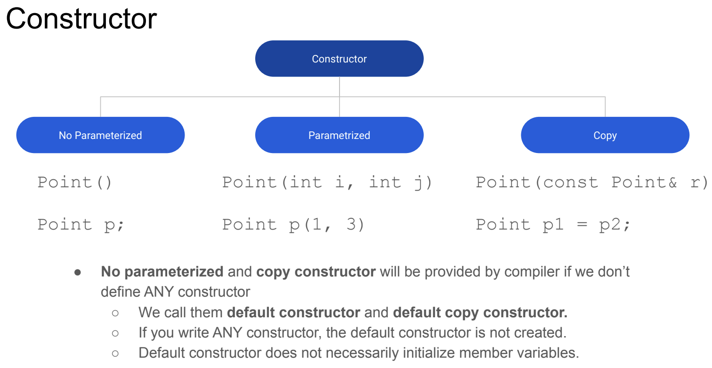

#### Deep & shallow copy 

复制构造函数

实现：

```C++
Point(const Point &rhs){//引用传递，另外const表示让数据来源“只读”，不会被意外修改
	//非指针的属性，正常赋值
  //动态内存的属性，要新开一块内存，然后把老对象的值复制给新的
}
```

==**构造函数，不返回类型**==

在构造函数中，传参**对象**时的三种方式：

- 值传递：❌，构造函数会一直被调用，陷入死循环
- 指针传递：✅，但是容易出错
- 引用传递：✅，简洁，调用复制构造函数

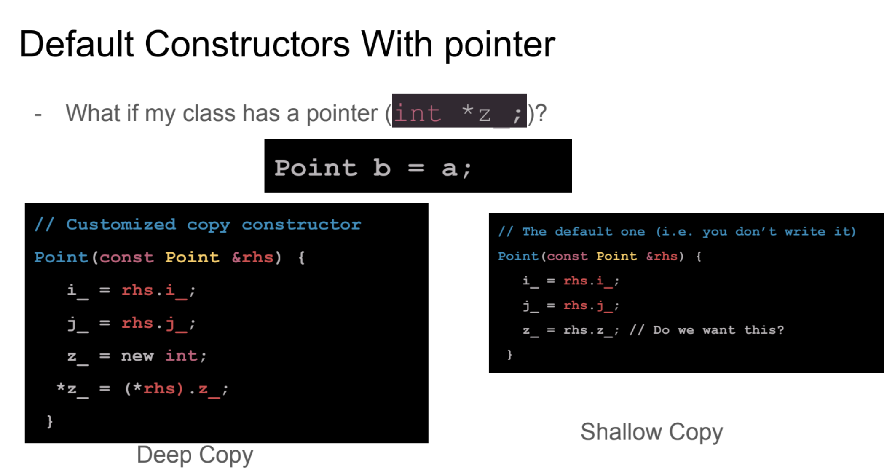

deepcopy这里写错了，应该是*z_ = *rhs.z_;

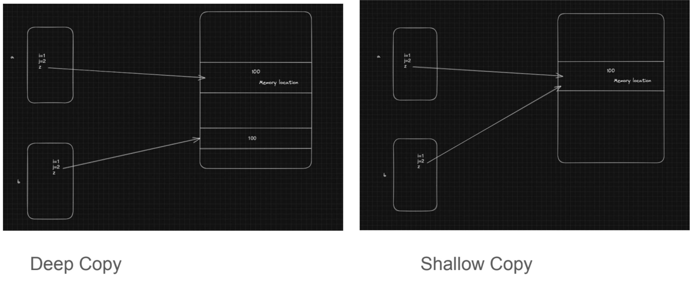

在使用动态内存分配时，需要使用deep copy，也就是不能使用默认的复制构造函数（这样实现的是浅拷贝），要自己定义：

```c++
//file: main.cpp
...
int main(){
	MyString str("I love C++, yeah!");
  {
    MyString str2(str);//调用默认的复制构造函数实现浅复制
    cout<<str2.get_string()<<endl;
	}//超出对象str2的生存期，str2被析构
  cout<<str.get_string()<<endl;//因为是浅复制，数据已被删除，会输出乱码
  return 0;//在析构str时，由于属性已经在str2时被回收，发生运行错误
}
```

由于浅复制，str2的m_pbuf和str的m_pbuf指向同一块堆内存空间

复制构造函数的使用场景

- 用类的一个对象去初始化该类的另一个对象时（显式）
- 函数的形参是类的对象时（可以理解为隐式）
- 函数的返回值时类的对象时（可以理解为隐式）

本质上都是在用类的对象去初始化另一个对象

```c++
void F(Point local_p) {
	//会调用拷贝构造函数和析构函数
  std::cout << "Inside F. Pass by value" << std::endl;
  std::cout << "local_p.i_: " <<local_p.i_ << ", local_p.j_: " << local_p.j_<< std::endl;
}
```

但是，如果在某函数传参时，使用的是引用传递，就不会调用拷贝构造函数和析构函数：

```C++
void F_reference(Point &p) {//只传递地址，没有新对象产生，本质是一个别名
	std::cout << "Inside F. Pass by reference" << std::endl;
}//
```

练习：

Write Deep Copy for the SinglyLinkedList class

```c++
class SinglyLinkedList {
public:
  SinglyLinkedList() { }
  ~SinglyLinkedList() { }
  ListNode *head_;
  // ...
};

//错完的版本
SinglyLinkedList(const SinglyLinkedList& head_){
  if ()
	ListNode* newNode = new ListNode();
  newNode->value = head_->value;
  newNode->next = head_->next;
}

//正确的
// 1. 这是一个拷贝构造函数，没有返回类型，参数是常量引用以保证性能和安全
SinglyLinkedList(const SinglyLinkedList& other) {
    if (other.head_ == nullptr) {
        head_ = nullptr;
        return;
    }

    // 2. 首先复制头节点，申请新内存
    head_ = new ListNode(other.head_->value);//由于ListNode的构造函数的默认实现，next指向nullptr

    ListNode* currentNew = head_;
    ListNode* currentOld = other.head_->next;

    // 3. 循环遍历旧链表，逐个“克隆”
    while (currentOld != nullptr) {
        // 为新节点申请独立内存，而不是直接指向旧地址
        currentNew->next = new ListNode(currentOld->value); 
        
        // 移动指针继续往后走
        currentNew = currentNew->next;//此时为nullptr
        currentOld = currentOld->next;
    }
}
```


#### 初始化列表

```C++
class Point {
public:
  // PARAMETERIZED Constructor Version 1
  Point(int i, int j) {
    std::cout << "**PARAMETERIZED constructor." << std::endl;
    i_ = i;
    j_ = j;
    z_ = new int;
  }
  // PARAMETERIZED Constructor Version 2 初始化列表
  Point(int i, int j) : j_(j), i_(i) { //先i后j
    std::cout << "**PARAMETERIZED constructor." << std::endl;
    z_ = new int;
  }
private:
  int i_;
  int j_;
};
```

==关于初始化列表使用时，成员初始化的顺序：==

==由成员定义的顺序决定，而不是初始化列表中的属性==

### Destructor

In most cases you only need a destructor only if you are **using dynamic memory allocation**.

程序会自己隐式地调用析构函数，因此在使用指针（动态内存分配）时，只需要实现一个析构函数，而不需要显示调用它

### 操作符重载

Pre and Postfix unary operators

```C++
// Prefix overload
// ++p;
Point& operator++() {
  i_++;//直接修改原对象
  j_++;
  return *this;//返回对象本身
}

// Postfix overload
// p++;
Point operator++(int) {
Point temp = *this;//先备份
  i_++; //修改原对象
  j_++;
  return temp;//返回备份
}

class Point {
public:
  // Copy assignment
  Point &operator=(const Point &rhs) {//这里必须使用引用，如果返回值（对象），会调用拷贝构造函数和析构函数（之前提到的）
    i_ = rhs.i_;
    j_ = rhs.j_;
    std::cout << "Copy assignment" << std::endl;
    return *this; // 赋值，改变自身，返回自身引用。注意：*this表示的是对象，this是指针。
  }
  Point operator+(const Point &rhs) const {
    Point res; //是函数内部的局部变量，函数执行完成会被销毁，
    res.i_ = i_ + rhs.i_;
    res.j_ = j_ + rhs.j_;
    return res; // 加法，创建新对象，返回新对象。不能使用引用，返回一个已被销毁的内存会崩溃
  }
  // Prefix overload, Point p2 = ++p1;
  Point &operator++() {
    i_++;
    j_++;
    return *this;
  }
  // Postfix overload, Point p2 = p1++;
  Point operator++(int) {
    Point temp = *this; // 1.
    ++*this; // 2
    return temp; // 3.
  }
```

#### ++p VS p++

++p: 先自增，再参与表达式运算（返回新值）

p++: 先参与表达式运算（返回旧值），再自增

各有各的用途

| **场景**                     | **推荐写法**   | **原因**                            |
| ---------------------------- | -------------- | ----------------------------------- |
| **基础类型 (`int`, `char`)** | `++i` 或 `i++` | 编译器会优化，两者基本无区别        |
| **自定义类对象**             | **`++p`**      | 避免调用拷贝构造函数，效率更高      |
| **STL 迭代器 (如 `list`)**   | **`++it`**     | 遵循标准 C++ 最佳实践，保证性能最优 |

对于for循环，在 `for(init; condition; increment)` 中，最后一项 `increment` 是一个**独立表达式**。

- 当你写 `++i` 时，它返回新值的引用，但循环逻辑并不使用这个返回值。
- 当你写 `i++` 时，它确实创建了一个旧值的副本并返回了，但 `for` 循环的控制结构**直接忽略了**这个返回值。

**循环关心的只是 `i` 变量本身是否被修改了。** 无论前置还是后置，`i` 最终都加了 1，所以循环能正常跑下去。

for中，二者都可，但**代价不同**。

重载代码：

- **`++i` 的逻辑：**

  C++

  ```
  i = i + 1;
  return i; // 直接给引用，没开销
  ```

- **`i++` 的逻辑：**

  C++

  ```
  int temp = i; // 额外开销：必须备份旧值
  i = i + 1;
  return temp;  // 返回备份，然后备份销毁
  ```


### Summary

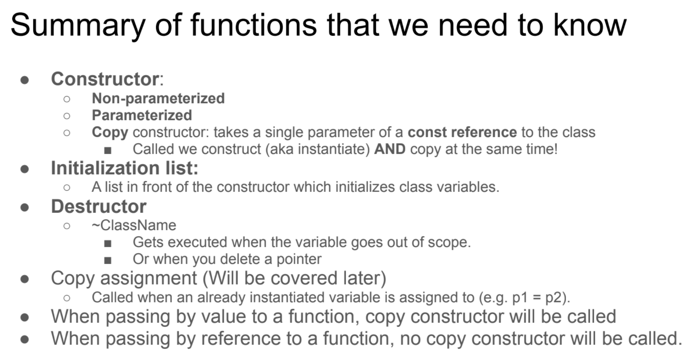

## 时间/空间复杂度计算

It's called runtime complexity, but it's really number of operations!

number of elementary operations in the **worst case** as a function of the input size.

在对比时，忽略到最大的一项 (n --> ∞)

忽略乘在前面的系数，加在后面的系数

时间复杂度取决于：input size 和 Algorithm

### Limitations of Big O

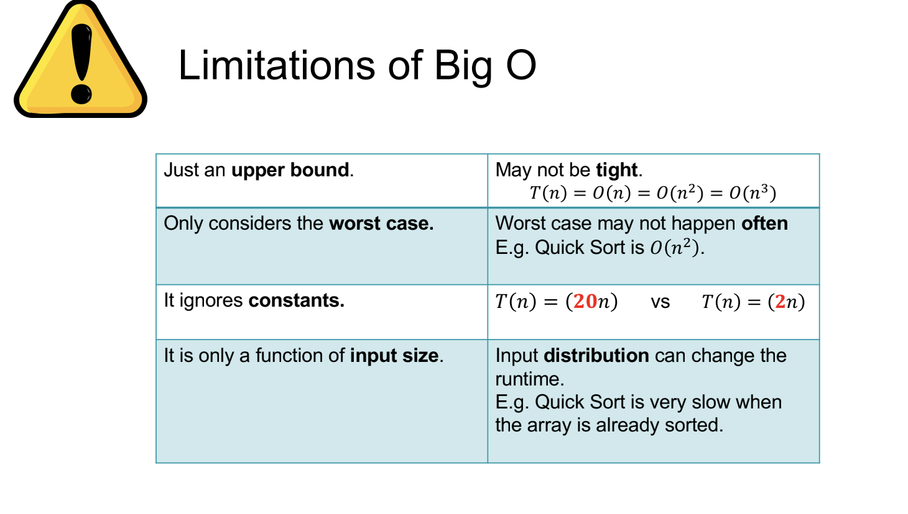

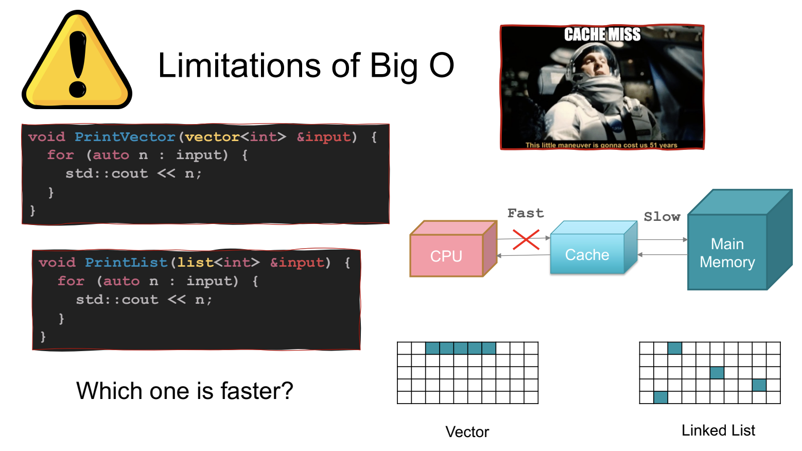

图二中，使用Vector要比Linked List快5-20倍，因为cache要不停的在内存中找，vector是连续内存存储，可以一次把一整块cache line读进cache。而list的节点分散在内存中，每次next都是一次指针跳转，cache line存在浪费。

## Data Structure

数据结构

### std::stack

栈，注意在top()和pop()之前， 先判空

```c++
std::stack<int> s;
int r = s.top(); // Seriously?
s.pop(); // Don't do this either!

// Do this instead
if(!s.empty()){
	s.pop();
}
```

### std::queue

队列，FIFO

- empty() 判断是否为空
- size()
- front() //read front
- push()
- pop()

### std::list

链表，是一个双向链表

优缺点：

- 内存不连续，查找很慢
- 插入/删除快
- 对缓存（Cache）不友好，现代CPU处理连续内存很快，但List散落在各处，导致CPU频繁去内存里“抓取”，命中率低（Cache Miss）。所以最好不要使用

#### std::list indexing

可以使用iteration迭代器

Using iterators, we only have access to the front and back of the list

- Front: begin()
- One after back: end()
- So index i would be:
  -  it=begin(); it++ (i times)
-  We can’t directly add to iterators
  - STL provides these functions:
    - std::advance
    - std::next

```c++
std::list<int> myList = {10, 20, 30, 40};
auto it = myList.begin();
std::advance(it, 2); // 手动移动到索引 2 的位置（即第三个元素 30）
std::cout << *it;
```

#### 链表的实现

```c++
struct ListNode {
  int val;
  ListNode *next;
  ListNode(int x) : val(x), next(nullptr) {} //initialization list
};
```

##### How to find the last node?

```C++
p = head;
while (p != nullptr) {
  p_prev = p;
  p = p->next;
}// p_prev就是
```

进行优化：

```C++
p = head;
while (p->next != nullpte){
	p = p->next;
}
```

##### push_back(22)

```C++
p = getBackPointer();
ListNode* newNode = new ListNode;
p->next = newNode;
```

##### pop_back()

```c++
p = GetOneBeforeBackPointer(); // p->next->next != nullptr;
...
```

##### insert_after(p, 22)

```c++
ListNode* newNode = new ListNode;
newNode->next = p->next;
p->next = newNode;
```

##### erase() 不用p_prev.

```c++
p->value = p->next->value; //复制后一个的值给自己
p->next = p->next->next; //跳过下一个节点
delete p;
```

If there are a lot of erase and insert, it seems that a linked list is faster.
Despite this, you should almost never use a linked list!

### Trees

#### Tree Data Structure

##### Tree

判断是否为树的定义就略过了，具有递归性Recursive

##### Binary Tree

二叉树

- Full Binary Tree 满二叉树
  - Each node has 0 or 2 children (no single child node)

- Complete Binary Tree 完全二叉树
  - All levels are filled, except the last one
  - Last level is filled from left to right

- Perfect Binary Tree 完美二叉树
  - All interior nodes have two children and all leaves
    have the same height.
  - Last level is completely full

- Balanced Binary Tree 平衡二叉树
  - The left and right subtrees of every node differ in height by no more than 1左右子树高度差不超过1

- Binary Search Tree 二叉搜索树
  - 左边比右边小
  - 没有重复的节点


##### Tree Height

- log2(n+1) <= height <= n，对于有N个节点的二叉树

- log2(n) appears in runtime of a lot of tree-based algorithms

- k层最多有$2^{k-1}$个节点
- 共k层的树最多有$2^k-1$个节点

#### Tree Algorithms (Recursion)

##### Traversal

遍历

- Depth First (口诀：Node的位置)
  - Preorder : Node, left, right
  - Inorder : left, Node, right
  - Postorder : left, right, Node
- Breadth first
  - Level Order 层序遍历

```c++
print(root){
	if (root == nullptr)	return;
	cout << root->val;
	print(root->left);
	print(root->right);
}

print(root){
	if (root == nullptr)	return;
	print(root->left);
	cout << root->val;
	print(root->right);
}

print(root){
	if (root == nullptr)	return;
	print(root->left);
	print(root->right);
	cout << root->val;
}
```

##### Storing Binary Trees 

in Vectors：

完全二叉树和完美二叉树非常适合存入vector/array中，因为效率高，浪费少，这也是为什么我们喜欢它们

Using Pointers：

```C++
struct TreeNode {
  int val;
  TreeNode *left;
  TreeNode *right;
  TreeNode(int x) : val(x), left(nullptr), right(nullptr) {}
};
```

##### Storing General Trees

 Using Pointers

```C++
struct TreeNode {
  int val;
  vector<TreeNode *> children;
  TreeNode(int x) : val(x) {}
};
```

##### Binary Search Tree

14 2 18 43 41 15 0

Convert this vector to BST

###### Insert in BST

```c++
void BST::insert(TreeNode *root, int v) {
  if (root == nullptr) {
    root = new TreeNode(v);
  } else if (v < root->val) {
    insert(root->left, v);
  } else if (v > root->val) {
    insert(root->right, v);
  }
}
t.insert(t.root_, 8);
t.insert(t.root_, 3);
t.insert(t.root_, 10);
t.insert(t.root_, 2);
```

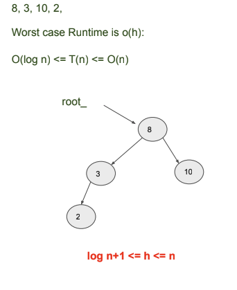

###### Search in BST

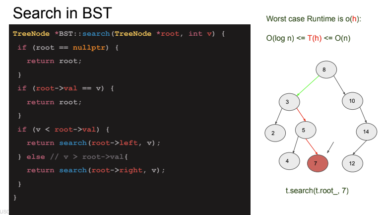

Visiting a BST in LNR order will give us nodes in Ascending order:

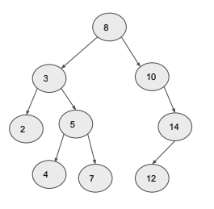

2, 3, 4, 5, 7, 8, 10, 12, 14

### Heaps

#### Heap Data Structure

##### Min Heap

最小堆

- complete binary tree
- parent is less than or equal to both children. Root is the smallest 
- Functions
  - Push(key)
  - Pop()
  - Key = top() //就是data_[0]

因为是完全二叉树的缘故，堆很适合使用vector存储。另外min heap找到min的时间复杂度是O(1)

```C++
class Heap {
public:
  int GetParentIndex(int i);
  int GetLeftIndex(int i);
  int GetRightIndex(int i);
  int GetParent(int i)
  int GetSmallestChildIndex(int i);
  int top();
  void push(int v);
  void pop();
  void TrickleUp(int i);
  void TrickleDown(int i);
private:
  std::vector<int> data_;
};
//因为是转换成vector的缘故，用i的乘法计算
int GetLeftIndex(int i) {
	if ((2 * i) + 1 >= data_.size()) {
		return -1;
	}
	return (2 * i) + 1;
}
int GetRightIndex(int i) {
	if ((2 * i) + 2 >= data_.size()) {
		return -1;
	}
	return (2 * i) + 2;
}

int GetParentIndex(int i) {
  if (i == 0) {
  	return -1;
  }
  return (i - 1) / 2;
}

int GetSmallestChildIndex(int i) {
  auto left_index = GetLeftIndex(i);//迭代器
  auto right_index = GetRightIndex(i);
  return data_[left_index] < data_[right_index] ?
  left_index :
  right_index;

  // What if left_index or right_index is -1?
}

int Heap::top() {
  if (data_.empty()) {
  	return INT_MAX;
  } else {
  	return data_[0];
  }
}

//push() 加到末尾，向上交换
void Heap::TrickleUp(int i) {
  // Fix the min heap property if it is violated
  while (i != 0 && GetParent(i) > data_[i]) {
  	Swap(data_[i], data_[GetParentIndex(i)]);
  	i = GetParentIndex(i);
  }
}

//pop() 去掉root，和末尾的交换，然后向下交换
void Heap::TrickleDown(int i) {
  // If it's a leaf node
  if (GetLeftIndex(i) > data_.size() && GetRightIndex(i) > data_.size()) {
  	return;
  }
  int smallest_child_index = GetSmallestChildIndex(i);
  if (data_[i] > data_[smallest_child_index]) {
    Swap(data_[i], data_[smallest_child_index]);
    TrickleDown(smallest_child_index);
  }
}
```

##### Array --> heap

O(nlogn)

```c++
Heap ConvertToHeap(const std::vector<int> &input) {
  Heap result_heap;

  for (int e : input) {
  	result_heap.push(e);
  }
  return result_heap;
}
```

O(n)

```c++
void Heap::ConvertToHeap(const std::vector<int> &input) {
  data_ = input;
  for (int i = data_.size() / 2; i >= 0; i--) {
  	TrickleDown(i);
  }
}
```

##### Max Heap

最大堆

- Parent bigger than or equal to both children 
- max is root
- Functions
  - Push(key)
  - Pop()
  - key = top()

##### STL Implementing

```C++
// max priority queue
std::priority_queue<int> q;
q.push(5);
q.push(15);
q.push(1);
q.push(42);
q.push(3);
q.push(2);
// One by one extract items from max heap
while (q.empty() == false) {
  std::cout << q.top() << std::endl;
  q.pop();
}

// min priority queue
std::priority_queue<int, std::vector<int>, std::greater<int> > q;
q.push(5);
q.push(15);
q.push(1);
q.push(42);
q.push(3);
q.push(2);
// One by one extract items from min heap
while (q.empty() == false) {
  std::cout << q.top() << std::endl;
  q.pop();
}
```

#### Heap Sort

By using pop() from a min heap

### Graph

“一笔画”：欧拉路径，通过图中所有边恰好一次的路径

```C++
bool Graph::IsEulerWalkable() {
  std::vector<int> degrees(v_.size());
  for (auto e : e_) {//遍历所有边
    degrees[e.first]++;
    degrees[e.second]++;
  }
  int countOdds = 0;
  for (auto d : degrees) {//遍历vector
    if (d % 2 == 1) {
      countOdds++;
    }
  }
  return (countOdds == 0 || countOdds == 2);
}
```

#### Definition

G = (V, E) 

- Vertex / Vertices
- Edges
  - undirected 
  - directed 

**Size:**

- |V|, n
- |E|, m
- m_max = n(n-1)

adjacent: two nodes are neighbors 

predecessor(parent) --> successor(child)

**Connectivity:**

Undirected

- Connected 
- Unconnected 

Directed

- strongly connected 能回到起点
- Weakly connected 不能
- Unilaterally Connected

#### Representation

图的三种表示方法

- Direct Translation of the Definition

- Adjacency List

- Adjacency Matrix

##### Direct Translation of the Definition

有set实现，也有vector实现

```C++
class Graph {
public:
  Graph(std::vector<int> &v, std::vector<std::pair<int, int>> &e): v_(v), e_(e) {}
  bool IsEulerWalkable();
  std::vector<int> v_;
  std::vector<std::pair<int, int>> e_;
};

//V={0, 1, 2, 3}
//E={(0,1), (1,2), (2,3), (3,0)}

int main() {
  std::vector<int> v = {0, 1, 2, 3};
  std::vector<std::pair<int, int>> e = {{0, 1}, {1, 2}, {2, 3}, {3, 0}};
  Graph g(v, e);
  std::cout << g.IsEulerWalkable() << std::endl;
}
```

(Assuming every node is connected to at least one edge. So we don't need V anymore)

##### Adjacency List

邻接链表（map+set）

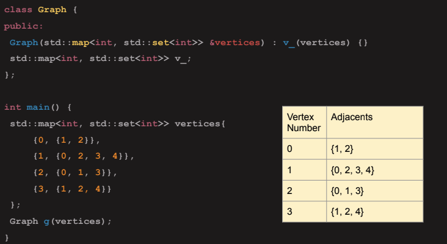

##### Adjacency Matrix

邻接矩阵 (Vector of vector)

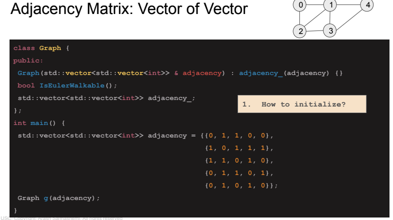

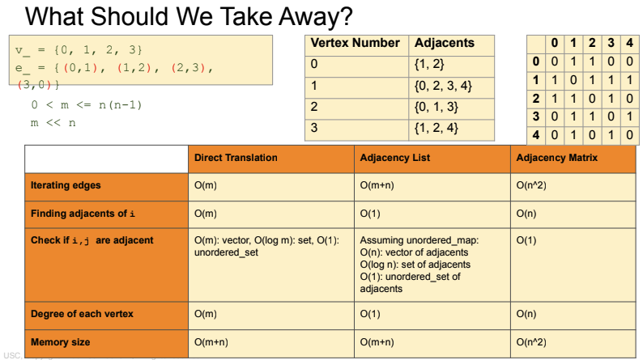

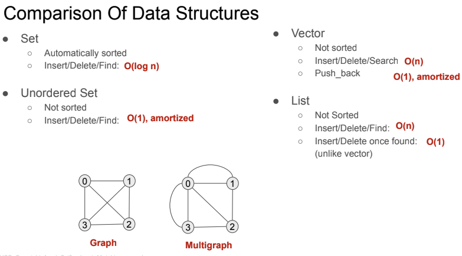

#### Algorithms

#### DFS

Depth First Search

选择任意一个节点作为root，访问过的做标记，递归选取一个未访问过的孩子节点。每个节点和边只访问一次。

递归算法

```C++
class MapSetGraph {
Public:
  void DFS(int root){
    std::map<int, int> &marks;
    DFS_helper(root, marks);
  }
  void DFS_helper(int root, std::map<int, int> &marks);
  std::map<int, std::set<int>> edge_map_;
};

void DFS_helper(int root, std::map<int, int> &marks) {
  marks[root] = 1;
  std::cout << "visited: " << root << std::endl;
  for (const int child : edge_map_[root]) {
    if (marks[child] != 1) {
      DFS_helper(child, marks);
    }
  }
}
```

How to Solve Recursive Algorithms ?

You should answer the following questions:

- What is the base case?
- What are my recursion calls (e.g. F(n-1) and F(n-2))
- How do I combine the solutions to the recursive calls? (e.g. we use ADD in Fibonacci)

What Can Help You?

- The recursion tree is your best friend on which you run DFS
  - The root is the recursive function, e.g. F(n)
  - Children of root: your recursive calls
  - The height of the tree gives me the memory complexity
  - The total nodes in the tree gives me runtime complexity
    - Assuming the combining function can be done in O(1)
      - E.g. Sum in Fibonacci can be done in O(1)
      - E.g. in MergeSort, the combining function, MERGE is longer than O(1)

In solving a recursive function, we are really running DFS on a recursion Tree.

DFS的非递归实现：

用stack栈

```c++
```


#### BFS

Breadth First Search

任意选一个节点作为root，访问过的做标记，visit all children of v before moving to v’s grandchildren, 在同一深度访问所有节点。每个节点和边只访问一次。

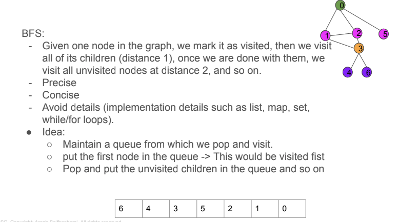

使用Queue实现，送进队列后的结果在上面（从根节点0开始）

```c++
void MapSetGraph::BFS(int root) {
  std::map<int, bool> visited;
  std::queue<int> q;
  q.push(root);
  visited[root] = true;
  while (!q.empty()) {
    int cur = q.front();
    q.pop();
    for (auto &n : edge_map_[cur]) {
      if (!visited[n]) {
        visited[n] = true;
        q.push(n);
    	}
    }
  }
}
```

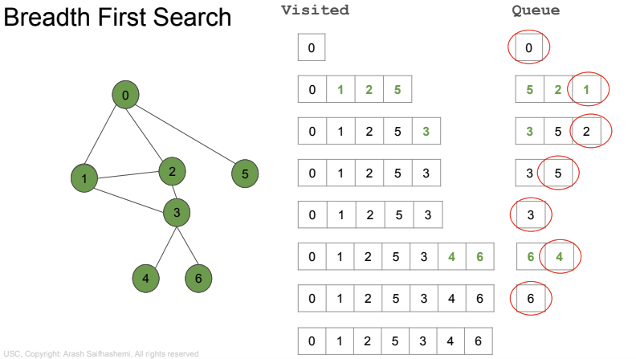

BFS当每个边的权重相等时，可以用来找到最短路径

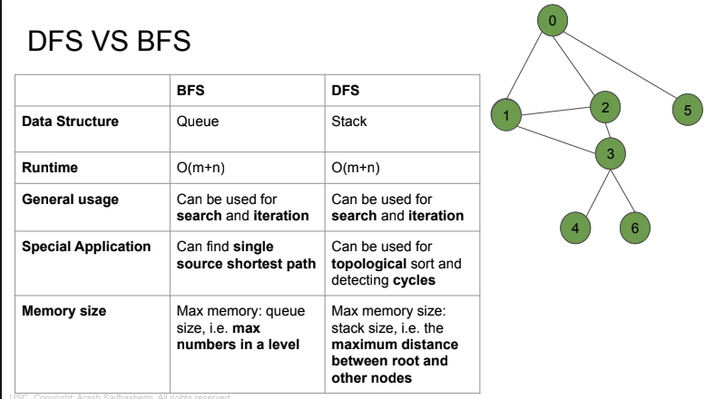

##### Grid Representation

 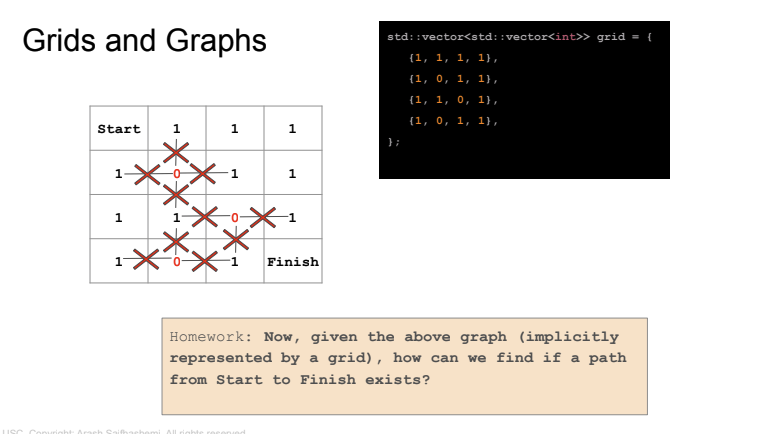

BFS 解决思路：

1. **起点入队**：将 `Start` 坐标 $(0,0)$ 放入队列。
2. **标记访问**：使用一个二维数组 `visited[4][4]` 来记录哪些格子走过，防止转圈。
3. **探索邻居**：从队列取出当前格，检查它的上下左右四个邻居：
   - 如果邻居坐标在界内、值是 $1$、且没被访问过。
   - 将邻居标记为已访问并入队。
4. **终点判定**：如果在探索过程中到达了 `Finish` 坐标 $(3,3)$，说明路径存在。

#### SDA

Shortest Distance Algorithms

SDP: The Shortest Distance problem

SPP: The Shortest Path Problem

##### Weighted Graph

##### Dijkstra

##### Bellman-Ford

##### Summary

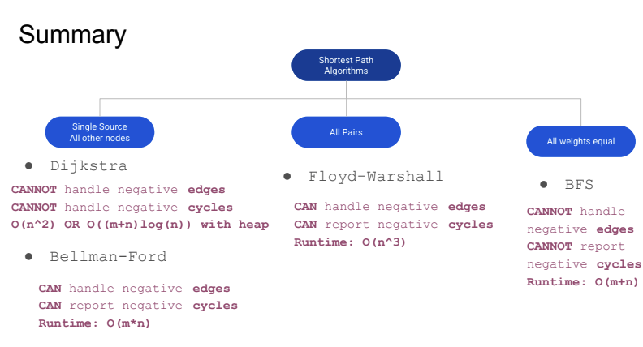

## Algorithm

算法

### Dynamic Programming 

动态规划  属于一种 算法优化，核心思路是通过“空间换时间”，解决递归中严重的**重复计算**问题

#### Memoization 

记忆化搜索 (AKA Caching AKA Look Up Table)

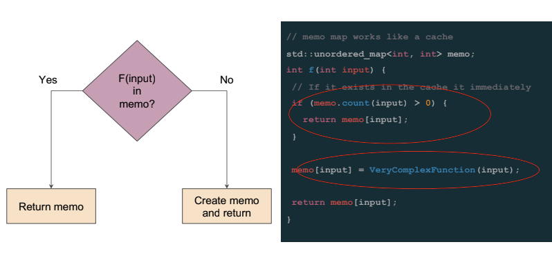

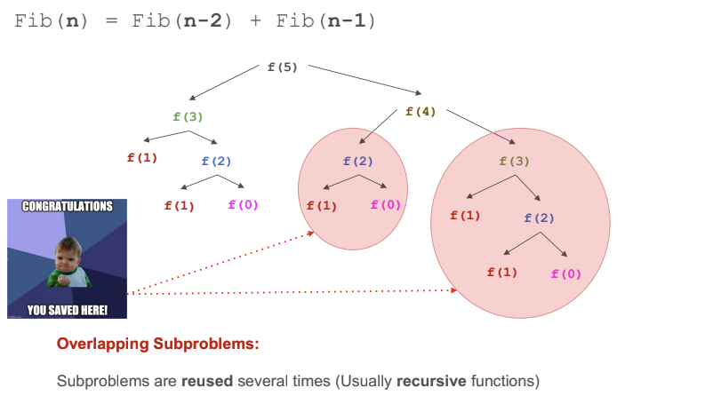

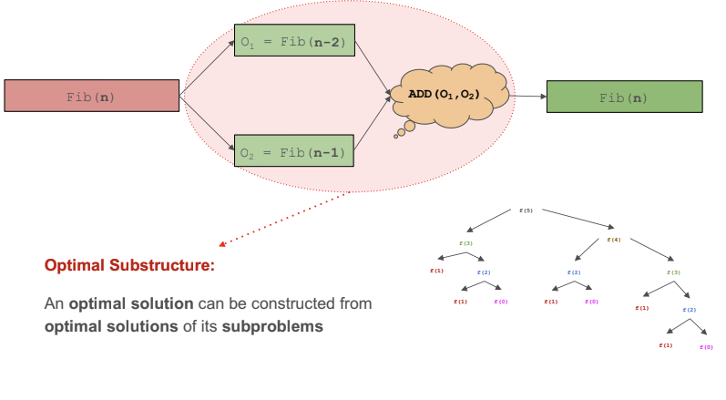

**Dynamic Programming ≈ Recursive function + Memoization**

```c++
// without memoization
int Fibonacci(int n) {
  if (n == 0 || n == 1) {
  	return 1;
  }
  int l = Fibonacci(n - 2);
  int r = Fibonacci(n - 1);
  return r + l;
}//存在多次重复计算

//With memoization
std::unordered_map<int, int> memo;

int Fibonacci(int n) {
  if (n == 0 || n == 1) {
  	return 1;
  }

  if (memo.count(n) > 0) {
  	return memo[n];
  } else {
  	memo[n] = Fibonacci(n - 1) + Fibonacci(n - 2);
  }
  return memo[n];
}//计算出来的数存起来，下次用时候直接拿，避免重复计算
```

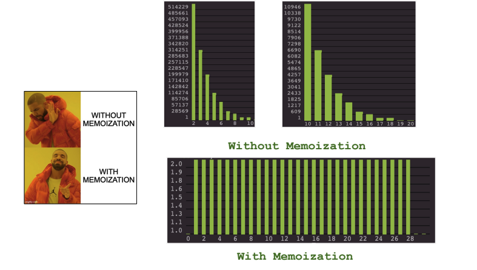

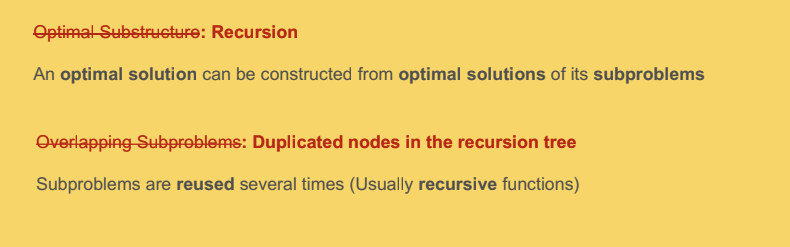

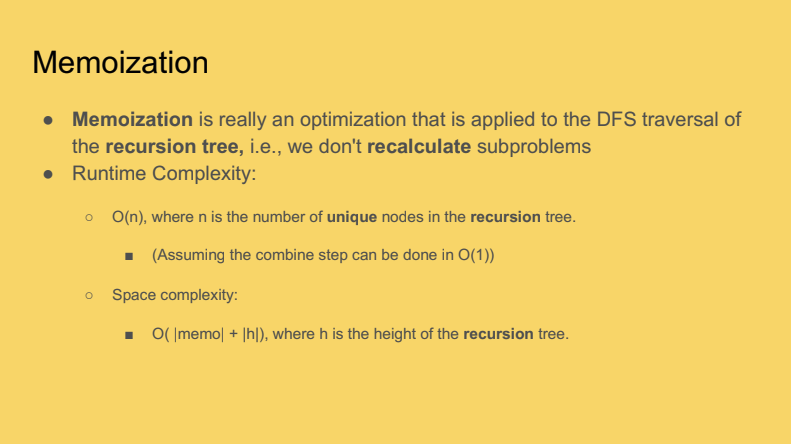

#### Bottom-up(Tabulation)

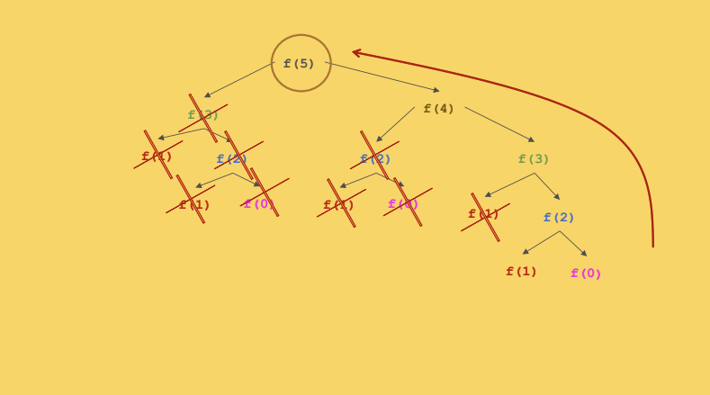

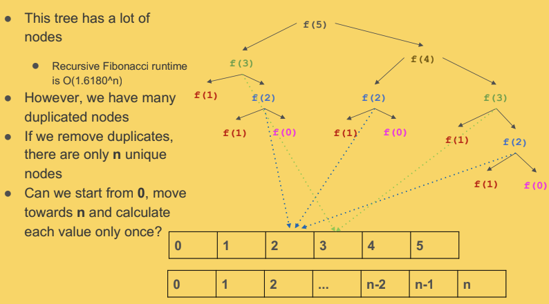

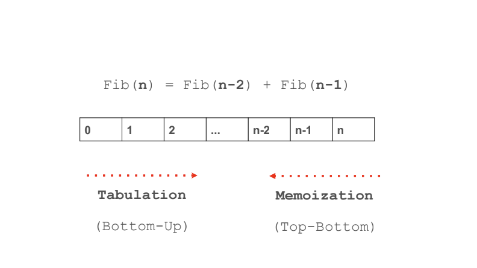

```c++
//Tabulation
int Fibonacci(int n) {
  // Allocate for 0 to n included
  std::vector<int> d(n + 1);
  d[0] = d[1] = 1;

  for (int i = 2; i <= n; i++) {
  	d[i] = d[i - 1] + d[i - 2];
  }
  return d[n];
}

//Memoization
std::unordered_map<int, int> memo;
int Fibonacci(int n) {
  if (n == 0 || n == 1) {
    return 1;
  }

  if (memo.count(n) > 0) {
    return memo[n];
  } else {
    memo[n] = Fibonacci(n - 1) + Fibonacci(n - 2);
  }
  return memo[n];
}
```

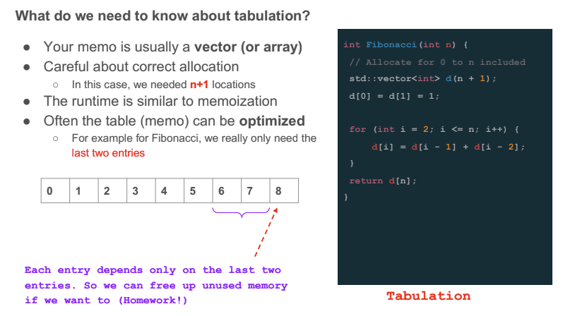

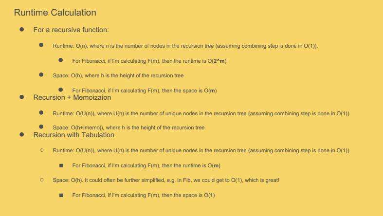

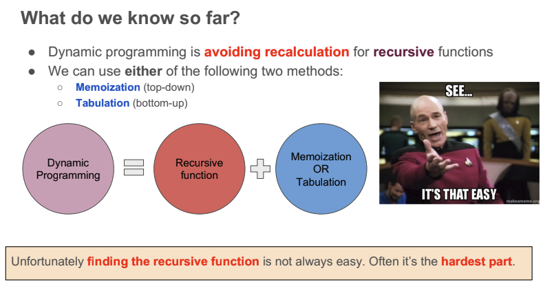

#### Approach a DP Problem

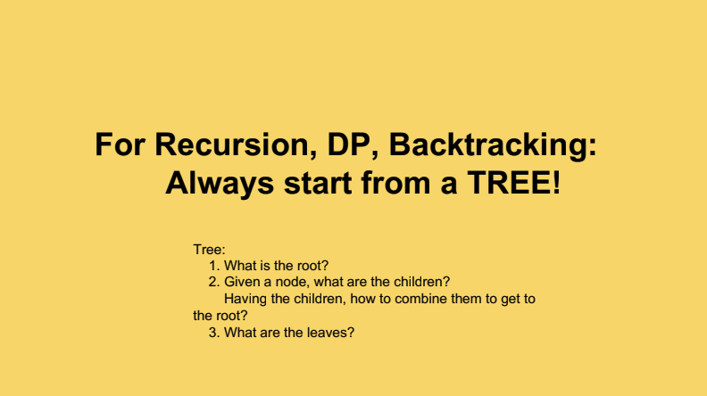

##### Coin Changing Problem

转化成递归树的形式

```C++
//(Non-Optimized) 递归暴力搜索
int CoinChange(std::vector<int> &coins, int amount) {
  if (amount == 0)
  	return 0;
  if (amount < 0)
  	return -1; // Indicates invalid
  int min = INT_MAX;
  for (auto coin : coins) {
    int n = CoinChange(coins, amount - coin);
    if (n >= 0) {
    	min = std::min(n, min);
  	}
  }
  if (min >= 0 && min < INT_MAX) {
  	return 1 + min;
  else
  	return -1;
}

//Memoization is your friend! 记忆化搜索
std::unordered_map<int, int> memo;
int coinChange(std::vector<int> &coins, int amount) {
  if (amount == 0)
  	return 0;
  if (amount < 0)
  	return -1;
  if (memo.count(amount) > 0)
  	return memo[amount];
  int min = INT_MAX;
  for (auto coin : coins) {
  	int n = coinChange(coins, amount - coin);
    if (n >= 0) {
    	min = std::min(n, min);
    }
  }
  if (min >= 0 && min < INT_MAX)
  	memo[amount] = 1 + min;
  else
  	memo[amount] = -1;
  return memo[amount];
}

//Tabulation 制表法
int coinChange(std::vector<int> &coins, int amount) {
  std::vector<int> d(amount + 1);
  d[0] = 0;

  for (int i = 1; i <= amount; i++) {
  	d[i] = INT_MAX-1; // -1 because we add +1 later

    for (auto coin : coins) {
      if (i - coin >= 0) {
        d[i] = std::min(d[i - coin] + 1, d[i]);
      }
    }
  }

  return d[amount] > amount ? -1 : d[amount];
}
```


##### 0-1 Knapsack Problem


##### LSCS (Optional)

Largest Sum Contiguous Subarray

##### LPSS (Optional)

Longest Palindromic Subsequence

#### Summary

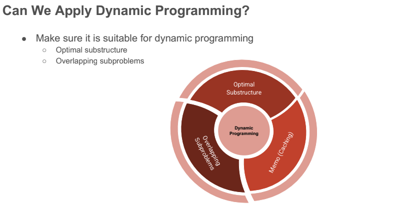

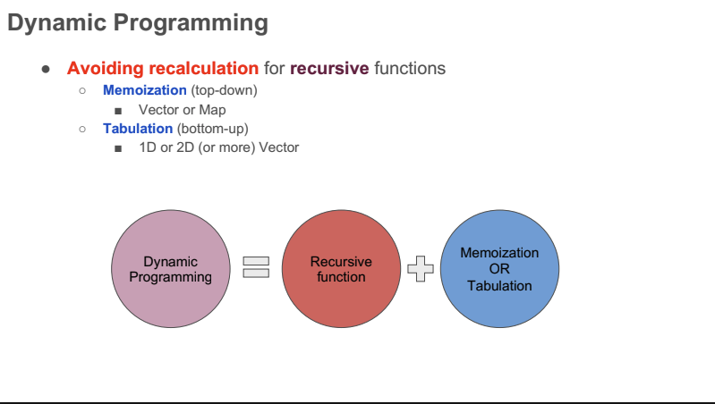

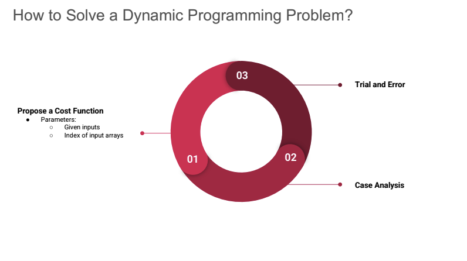

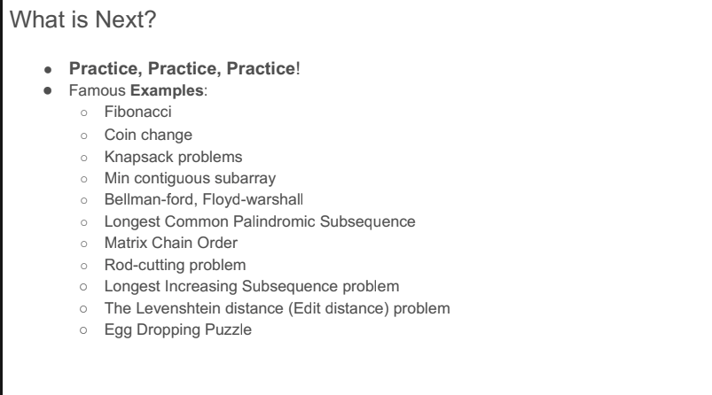

### Backtracking

回溯

### Sort Algorithms

排序算法

#### Quick Sort


#### Summary

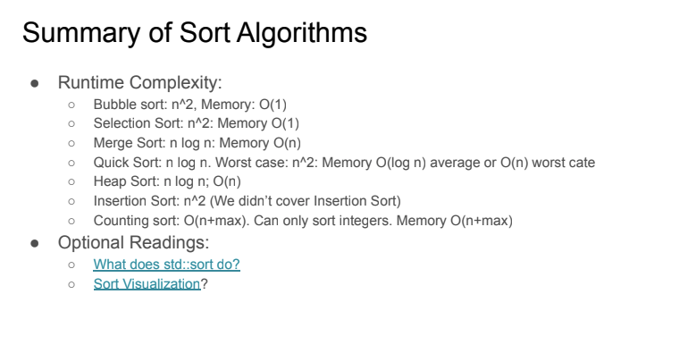
