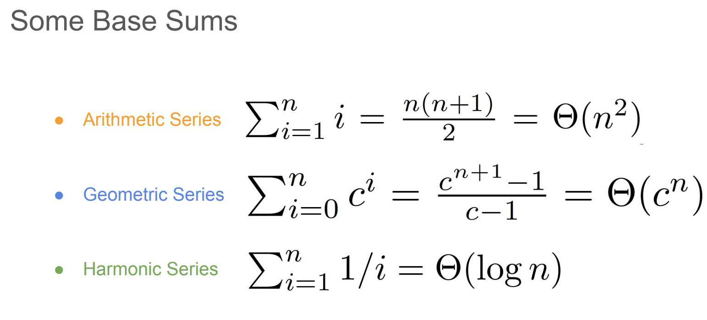
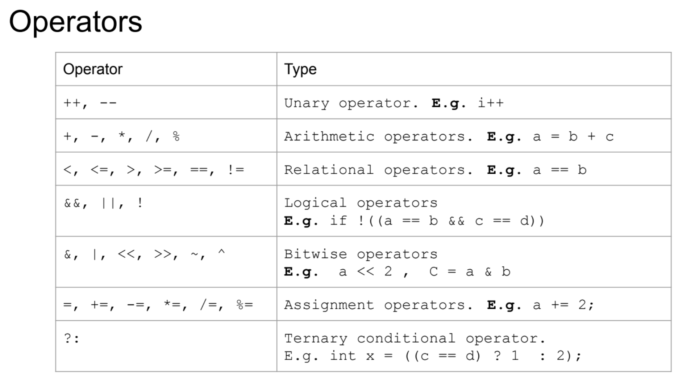
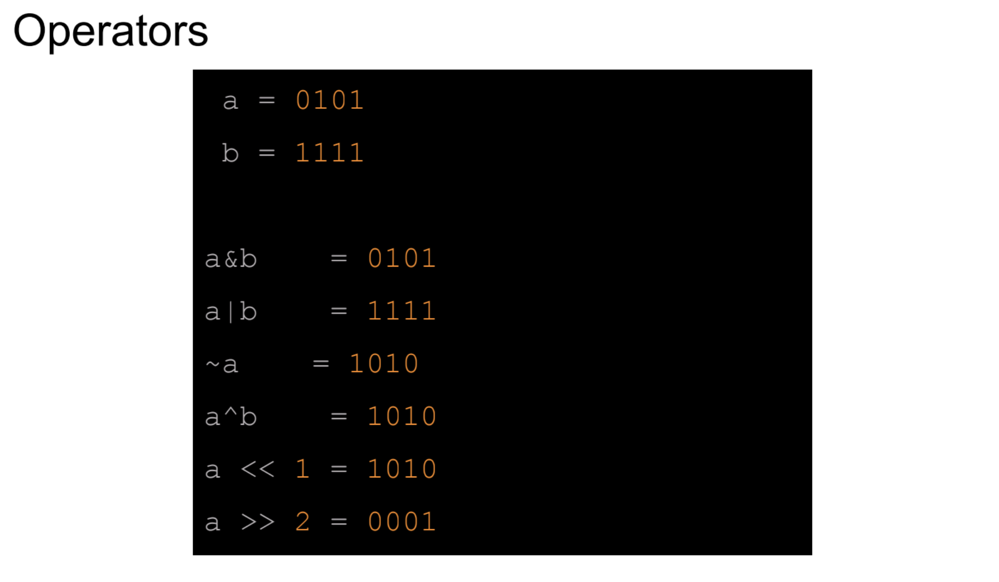
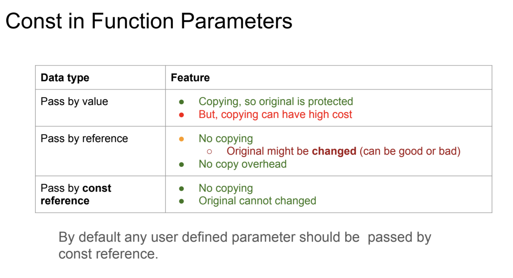

## Instruction

C++基础
- 语法

软件工程基础
- 测试、Source Control, Shell scripts
- 动态编程
- OOP

算法与数据结构基础
- 树、链表、哈希、堆...
- 时间复杂度分析
- 算法：贪心，recursion递归，动态规划...

## Programmer Basic Tools

注册Stackoverflow 账号

注册Github账号

- VS Code
- Git
- Linux-compatible terminal
- C++ Toolchain 
  - Mac: Xcode + Bazel
  - Windows: Cywin or MinGW
  - Linux: GCC + Bazel

## C++的设计理念和特性

快，不像python或java一样在运行代码的时候，编译器像个保姆，内置了很多检查机制。而C++更像“程序员知道自己在做什么”。

“You only pay for what you use”

C++的灵魂，是如果你不需要某个功能（比如安全检查），你就不用为它付出性能代价。

例如：
如果一个数组的大小是10，我们试图访问第100个元素，Python会抛出IndexError并停止运行。C++会直接去内存中偏移量为100的位置读写数据。这样会导致：
- 那块内存正好没有被使用，程序看起来正常
- 那块内存存折系统关键指令，修改后导致程序崩溃
- 其他变量的值被修改，导致出现难以排查的逻辑错误

但是现在比较新的C++，很大程度上规避了这些风险，虽然仍然存在，但是可以让C++具有高性能的同时，获得了更高的安全性。

## 编译器

.h file: Only the declarations

.cc/cpp file: Implementations  **--compile-->** .o file **-->** executable

## 关于写码

Find corner cases 边界问题
Pseudo-Code 伪代码

规范的步骤：

1. 仔细分析问题，细节考虑
2. 边界问题的考虑
3. 写出算法的outline（可能有很多种思路）
   1. 对比性能，谁更快，更高效
4. 实现
5. 测试
6. 验证代码的正确性
   1. Induction 数学归纳法
   2. Contradiction 反证法
   3. Case Analysis 分类讨论
   4. Other techniques

### Induction

数学归纳法：k = 1时成立，如果 k 时成立，推导对于k+1也成立

### Unit Tests

- A unit test is a piece of code that tests a function or a class
-  Unit tests are written by the developer

### Version Control

Who, what, where, when, why

#### Git

- Modified: 只是修改，还没有提交到仓库
- staged: 已经在当前版本中标记了已修改的文件，以便将其放入下次提交快照(snapshot)中
- Committed: 数据已经安全保存到数据库

### Runtime Analysis

- Count the number of elementary operations instead of timing them.

- Consider the Worst Case. Make the runtime a function of the size of the input. It is just an estimate.

时间复杂度的计算：



## C++语法

overloaded重载

### 操作符



其中，Bitwise operators的用法是：



### 数据类型

Primary

- int
- char
- bool
- float
- double
- void

Derived

- array
- pointer
- References

User Defined

- struct
- class
- union
- enum
- typedef

Variables and Modifiers

- signed
- unsigned 
- long
- short

**各种数据类型的bytes，bits长度**


#### enum

enum class更规范

```c++
// Enum type in C:
enum ColorPallet1 { Red, Green, Blue };
enum ColorPallet2 { Yellow, Orange, Red };

// Enum Class in C++
// Declaration
enum class ColorPalletClass1 { Red, Green, Blue };
enum class ColorPalletClass2 { Yellow, Orange, Red };

// Assignment
ColorPalletClass1 col1 = ColorPalletClass1::Red;
ColorPalletClass2 col2 = ColorPalletClass2::Red;
```

#### auto

```c++
for (auto n : my_vector){
  std::cout<< n;
}
```

#### **Pointers**

```c++
int a = 1;
int* pp = &a;
int** r = &pp;
std::cout << "r: " << r << std::endl;
std::cout << "*r: " << *r << std::endl;
std::cout << "**r: " << **r << std::endl;
// 如果写
int* r = &pp;
//会报错，因为&pp的类型是int**，而定义的r是int*
//int* r 和 int *r 的两种写法是等价的，最好固定一种写法
//另外，在定义时不要写成
int* p,q; //这实际上定义的是一个指针p和一个整型q, 另外，指针定义的时候，要初始化：int* p = nullptr
```

Pointer : new and delete

使用的是堆heap，动态内存分配

```c++
int i = 5;
int* p = new int;
p = &i; //上面定义new int的地址就已经丢失了 
delete p;// 忘记delete会导致内存泄漏
```

一般来讲，引用比指针更加的安全

#### **References**

```c++
int i = 10;
int& j = i;
j++;
```

Passing parameters

参数传递要用指针或引用，用变量本身只是临时复制了一个函数内的变量，不会改变外部的值

```c++
int main() {
  std::vector<int> my_vector = {1, 2, 3, 4, 5, 6, 7, 8};
  for (auto n : my_vector) {
    n++;
  }
  // What is the value of my_vector? 不变
  for (auto &n : my_vector) {
    n *= 10;
  }
  //{10, 20, 30, 40, 50, 60, 70, 80}
  return 0;
}
```

#### Array

- Size is fixed at compile time
- Cannot be resized
- There is not a reliable way to find the array size
- Can be misused (out of bound)

arr[i] → *(arr + i) 本质上依旧是指针

#### Dynamic Array

- ==Size doesn’t have to be known at compile time==
- Cannot be resized
- There is no way to find the size.
- Can be misused (out of bound)

```c++
arr = new int[size];
delete [] arr;
push_back(int*& arr, int& size, int new_item)//和动态数组相关的函数，也需要加入size这个参数
```

Dynamic arrays should really carry their size with them, that
means we often use two variables for them:
- A pointer to the beginning of the array
- The size of the array

对于现代C++，会尽量避免使用裸指针的用法，使用vector这个STL用法的函数

#### std::vector

An enhanced version of Arrays

● ==Size doesn’t have to be known at compile time==

● ==Can be resized automatically==
● ==The size is always kept updated==

● Can be misused (out of bound) with [ ]
	○ ==Misuse can be controlled using at() method==

Important methods to know:

- v.push_back(1). Compare this to push_back(my_dyn_array, size, 1)
- v.pop_back()
- v.insert()
- v.erase()
- size(): v.size()
- What is the runtime complexity of v[i] ?

#### std::string

- push_back()
- pop_back()
- getline()
- concat
- insert()

### Flow Control 

If, switch

while, for, do-while	

### Namespaces

```c++
namespace ns1 {
int x = 1;
void Print() { std::cout << "Printing example 1." << std::endl; }
} // namespace ns1
namespace ns2 {
int x = 2;
void Print() { std::cout << "Printing example 2." << std::endl; }
} // namespace ns2
// Global namespace
int x = 3; // ::x

int main() {
std::cout << "ns1::x: " << ns1::x << std::endl;
std::cout << "ns2::x: " << ns2::x << std::endl;
ns1::Print();
ns2::Print();
```

### Variable scope

- Global全局变量
- Local局部变量

### Const

将一个变量定义为常量

可以用到函数里，也可以用到类(Class)上



### STL

**S**tandard **T**emplate **L**ibrary of C++

#### std::vector

#### std::set< Type >

有序的去重集合

Important methods to know

- size()
- insert()
- count()
- find()
- erase()

Things to know about std::set:
○ Internally it is sorted based on keys
○ Access, Insert, and find complexity is O(log(n))
○ Reinserting the same key will just update the data, there is no duplicate keys

#### std::pair<T1, T2>

○ Couples together a pair of things (of type T1 to T2)
○ For a pair of items p:

- Access the first item by p.first
- Access the second item by p.second.

```C++
std::pair<std::string, int> p1("Ari", 3);
std::pair<std::string, int> p2("Ted", 4);
std::pair<std::string, int> p3 = p1;

std::cout << "p1.first: " << p1.first << std::endl;
std::cout << "p1.second: " << p1.second << std::endl;
```

#### std::map<Key, Value>

也叫字典Dict，底层用红黑树实现

Important methods to know
○ size()
○ insert()
○ count()

Things to know about std::map:
○ Internally it is sorted based on keys
○ Access, Insert, and find complexity is O(log(n))
○ Map is really a collection of pairs
○ Accessing a non-existent key using [ ], creates that key
○ No duplicate keys

关于拉链法和如何设计哈希函数，可以参考之前专门讲hashmap的博客

#### std::unordered_map

底层用哈希表实现

map / set = 有序、稳定、慢一点
unordered_map / unordered_set = 无序、快、但不稳定

#### Iterators

Used for iteration of STL objects

---

STL: A set of C++ template classes and functions

Four components
○ Algorithms
○ Containers: vector, set, map
○ Functions
○ Iterators

```C++
std::vector<int> v = {1, 2, 3, 4, 5};
// An easy way of iteration
for (int n : v) {
std::cout << "n: " << n << std::endl;
}
// General way of iteration
std::vector<int>::iterator it;
for (it = v.begin(); it != v.end(); ++it) {
int n = *it;//可以理解为一个指针
std::cout << "n: " << n << std::endl;
}
```

v.begin(): address of the first item

v.end(): address AFTER the last item or NULL

**A More Modern Way of Using Iterators**

```C++
// using auto
std::set<int> s = {1, 2, 3, 4, 5};
for (auto it = s.begin(); it != s.end(); ++it) {
const int &n = *it;//const防止修改，引用防止复制。想要修改就把const去掉
std::cout << "n: " << n << std::endl;
}
```

**Why Iterators?**

迭代器 = STL的泛化“指针”，可以兼容所有STL基本容器的迭代方法，统一接口，切不暴露底层的指针，支持不同类型的访问，代码复用性好

```C++
// Insert a number before 3
std::vector<int> v = {1, 2, 3, 4, 5};
for (auto it = v.begin(); it != v.end(); ++it) {
  const int &n = *it;
  if (n == 3) {
    it = v.insert(it, 12);//这里会返回一个迭代器对象，必须重新对it赋值，不能只调用，因为插入后，原来的it失效了，下一次使用*it时，会报UB的错(Undefined Behavior!)
    ++it;
  }
}
```

#### STL Algorithm

Passing Functions As Parameters
