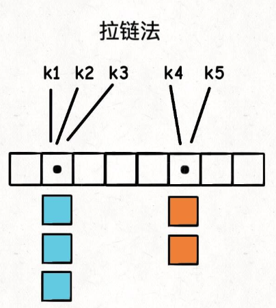
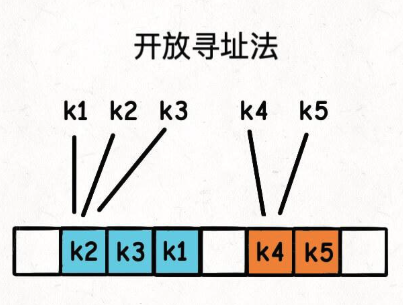

# Hash Map

哈希表底层原理 & 应用

参考作者来源：https://labuladong.online/algo/data-structure-basic/hashmap-basic/#%E5%93%88%E5%B8%8C%E5%86%B2%E7%AA%81

## 定义

本质上，hash map是从==key==到==value==的映射。

value 是需要被 存储 或 增删查改 的值，其中：

- > **key** 必须是可哈希、不可变、唯一的（如 int、str、tuple、bool、float、自定义类对象）。

- > **value** 可以是任意类型，甚至是另一个哈希表。

key必须可哈希，反例：key为list(列表)、dic(字典)、set(集合)，这些数据结构是可变的

```python
a = [1, 2, 3]
print(hash(a))  # ❌ TypeError: unhashable type: 'list'
```

如果想使用列表作为哈希，需要将其转换为tuple(元组) or ... :

```py
a = [1, 2, 3]
key = tuple(a)  # (1, 2, 3)

d = {key: "固定列表"} 
print(d[(1, 2, 3)])  # ✅ "固定列表"
```

而value可以是任意类型，甚至可以是一些复杂结构如：自定义对象、函数、类、模型等


key是独一无二的，value是可重复的

## 实现原理

hash map的实现原理，是利用了一个新定义的数组==table==，数组==table==的长度称做==capacity==，每一个元素一般称为==桶==，value被存入其中。

```python
哈希值 = hash(key) # 哈希函数是一种 *特别的算法，将key转换成整数int，它可以是负数，例如java的int hashCode()
index = 哈希值 % capacity # 因为取模，所以满足数组下标一定是正整数，取模运算也可以写在hash函数内部
```

*在java中，任意一个java对象都会有一个 int hashCode()方法，默认的实现中，返回的其实就是该对象的内存地址，这样的地址就符合全局独一无二的定义，算是一个可以将任意对象转换为整数的例子。


通过这种方式，通过key增、删、查、改的时间复杂度都是O(1)

## 哈希冲突

通过这种方式，我们就可以实现key到value的映射。但是也会随之产生一个问题：

- 通过取模运算，我们将无限大的空间压缩到了有限的空间，必然会导致不同的key得到相同的index。比方说n+1个key映射到长度为n的table中，至少会有两个key的index相同，从而使不同的value存到了相同index下

应该如何解决这样的问题呢？一般分为两种方法：

### 拉链法

桶 用来存储链表，不直接存value类型。当遇到哈希冲突时，就会将新加入的冲突元素插入表头



### 开放寻址法

又叫线形探查法，若一个key通过hash计算得到的index已经被其他key占了，那么就将值存到index+1，直到找到一个为空的index+i为止。（这里index+i可以是其他的探测函数，不一定非要+1）

刚开始可能会有疑惑，如果index在探测的过程中，遇到了其他已经存好的key，且这些key与现在的key不冲突，怎么办？

其实是不影响的，同样的算法继续往后找空位置即可。在查找操作时，要使用同样的探测函数



## 扩容和负载因子

当出现哈希冲突时，虽然上面的两种方法可以解决问题，但是会导致查链表或顺着探查时，复杂度会变成O(K)，其中K是链表长度or连续探查次数。

这会导致性能下降。


首先要考虑，是什么导致的哈希冲突频繁出现呢？

- 哈希函数设计不佳，导致key分布不均匀，很多key被映射到了相同的index值
- 哈希表已经装了很多key-value对，哈希冲突已经很严重无法避免。


问题一的话，就是从hash函数设计层面解决了

问题二，可以引出 复杂因子：

==负载因子== 表示哈希表装满的程度，复杂因子越大，哈希表中存放的key-value对越多。

```python
负载因子 = size / capacity # size表示哈希表中存储的key-value对数
```

可以通过设定复杂因子的==阈值==，一般为0.75，并对table进行==扩容==（提升capacity），从而控制哈希冲突的频率

## 使用方式 & 应用场景

写法：在python中一般是dict字典 or set集合

```py
# 创建空字典
d = {}

# 或者用 dict() 构造
d = dict()

# 带初始值
d = {"Alice": 90, "Bob": 85}

d["Charlie"] = 88       # 插入新键值对
d["Alice"] = 95         # 更新已有键的值

print(d["Alice"])       # 95
print("Bob" in d)       # True
print(d.get("Tom", 0))  # 如果键不存在，返回默认值 0

del d["Bob"]            # 删除键 Bob
val = d.pop("Charlie")  # 删除并返回值
d.clear()               # 清空字典

for key in d:                     # 遍历键
    print(key, d[key])

for key, val in d.items():        # 同时遍历键和值
    print(key, val)
    
# 集合写法
s = set()
s = {1, 2, 3}

s.add(4)
s.remove(2)
print(3 in s)  # True
```

应用场景：

- 判重，去重：

  ```python
  nums = [1, 2, 2, 3, 1]
  unique = list(set(nums))   # [1, 2, 3]
  ```

- 统计频率(计数器):

  ```py
  from collections import Counter
  freq = Counter("banana")
  print(freq)  # {'b': 1, 'a': 3, 'n': 2}
  ```

- 两数之和（LeetCode 1):

  ```py
  def twoSum(nums, target):
      seen = {}
      for i, num in enumerate(nums):
          if target - num in seen:
              return [seen[target - num], i]
          seen[num] = i
  ```

## 面试中的常见问题

