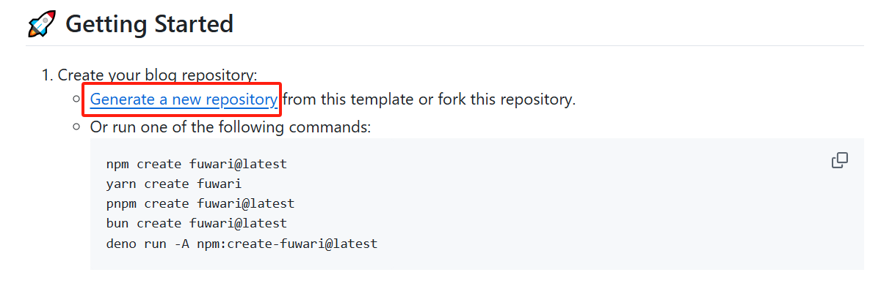
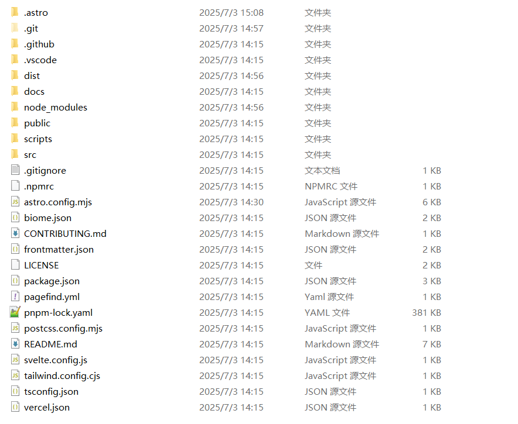

项目原地址：[saicaca fuwari](https://github.com/saicaca/fuwari?tab=readme-ov-file)

挑模板挑了很久，个人任务原博主的这个模板非常好看O(∩_∩)O。
但是由于我是小白，在上手初期看到博主github上的步骤时，有点懵也踩了不少坑，于是乎就有了这篇文章。

我会尽量保姆式的教学如何搭建一个这样的博客，可能对新手会相对友好一些~

# 前言
这个网站的实现，主要使用到的是：

Github的Pages服务，它能够将我们托管在名为`username.github.io`仓库下的前端代码渲染成静态的页面。在完成部署后，我们就可以直接在`https://www.username.github.io`访问我们的博客。

Astro是一个现代化的 静态网站生成器，专为构建快速、内容驱动的网站而设计（如博客、文档站、营销页面等）。

除此之外我们还会用到Github的Actions服务，它允许你通过编写工作流（Workflow）脚本，自动完成代码测试、构建、部署等任务。在我们推送代码到 main 分支后，会自动将静态网页部署到 GitHub Pages


# 准备工作
**(适用于Windows系统)**

在开始之前，需要先安装一些工具：

Node.js、npm、pnpm、Git

除此之外，我们需要有一个Github账号，网上有很多注册账号的方法，Github也是非常好用的开源代码仓库，具体如何注册不再赘述。

## 下载Node.js，npm

npm 是 Node.js 的包管理器，安装 Node.js 时会自动安装 npm。

我们在[Node.js官网](https://nodejs.org/en/download/)下载LTS版本。

下载后，默认安装，之后打开cmd命令行工具，输入
```cmd
node -v
```
安装成功后，会显示版本。这里我的版本是：v22.17.0

```cmd
npm -v
```
显示npm版本，我的版本是：10.9.2

## 下载Git
Git可以帮助我们实现GitHub仓库的代码到本地的克隆，以及之后的上传

[Git官网](https://git-scm.com/)

下载完成后，默认安装。
我们使用右键可以发现可以之际看到Git的帮助栏，有`Open Git Bash Here`的选项。通过它我们就可以在对应的目录下换出git的命令行工具

# 本地部署
之后我们点开原博主的项目地址


点击Generate a new repository，在Repository name下填入username.github.io，之后点创建仓库。

自己定一个地方，新建一个文件夹，在该路径下进入cmd

使用git把我们创建好的仓库克隆到本地
```cmd
git clone https://github.com/username/username.github.io.git
```

可以看到已经把项目拉取到本地了



在这个文件夹下右键打开Git Bash
运行
```cmd
// 下载pnpm
npm install -g pnpm

// 安装项目的依赖
pnpm install
```
下载完成后，在Git Bash下运行
```cmd
astro dev
```
浏览器访问`http://localhost:4321/`即可看到本地部署的模板

## Home页面
- 打开`src/config.ts`文件，修改对应的内容即可修改博客页面

## 博客
- 在src/content/posts下新建md文件，即可添加博客
- markdown的常见用法可以查看下一篇博客

  
# 部署到Github
github仓库中，点击settings, Pages, 选择Github Actions

依次运行
```cmd
npm run build
git add .
git commit -m "第一篇博客"
git push origin main
```

未完待续...