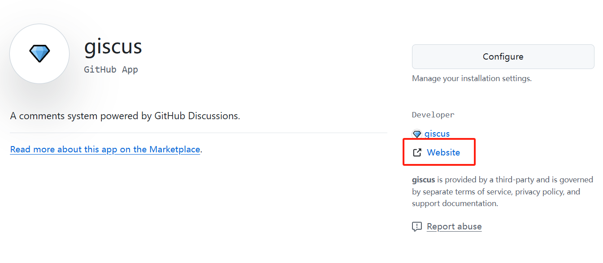
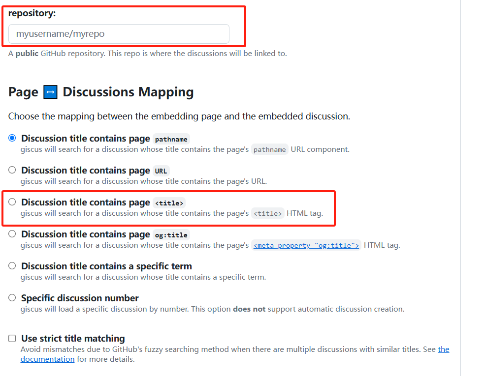

项目源地址：[saicaca fuwari](https://github.com/saicaca/fuwari?tab=readme-ov-file)

挑模板挑了很久，个人认为原博主的这个模板非常好看O(∩_∩)O。
但是由于我是小白，在上手初期看到博主github上的步骤时，有点懵也踩了不少坑，于是乎就有了这篇文章。

我会尽量保姆式的教学如何搭建一个这样的博客，可能对新手会相对友好一些~

# 前言
这个网站的实现，主要使用到的是：

Github的Pages服务，它能够将我们托管在名为`username.github.io`仓库下的前端代码渲染成静态的页面。在完成部署后，我们就可以直接在`https://www.username.github.io`访问我们的博客。

Astro是一个现代化的 静态网站生成器，专为构建快速、内容驱动的网站而设计（如博客、文档站、营销页面等）。

除此之外我们还会用到Github的Actions服务，它允许你通过编写工作流（Workflow）脚本，自动完成代码测试、构建、部署等任务。在我们推送代码到 main 分支后，会自动将静态网页部署到 GitHub Pages


# 准备工作
**(适用于Windows系统)**

在开始之前，需要先安装一些工具：

Node.js、npm、pnpm、Git

除此之外，我们需要有一个Github账号，网上有很多注册账号的方法，Github也是非常好用的开源代码仓库，具体如何注册不再赘述。

## 下载Node.js，npm

参考来源: [GitHub+Hexo 搭建个人博客](https://cmymoon.com/2024/01/17/hexo-github-da-jian-ge-ren-bo-ke/)

npm 是 Node.js 的包管理器，安装 Node.js 时会自动安装 npm。

我们在[Node.js官网](https://nodejs.org/en/download/)下载LTS版本。

下载后，默认安装，之后打开cmd命令行工具，输入
```cmd
node -v
```
安装成功后，会显示版本。这里我的版本是：v22.17.0

```cmd
npm -v
```
显示npm版本，我的版本是：10.9.2

## 下载Git
Git可以帮助我们实现GitHub仓库的代码到本地的克隆，以及之后的上传

[Git官网](https://git-scm.com/)

下载完成后，默认安装。
我们使用右键可以发现可以直接看到Git的帮助栏，有`Open Git Bash Here`的选项。通过它我们就可以在对应的目录下换出git的命令行工具

# 本地部署
之后我们点开[saicaca fuwari](https://github.com/saicaca/fuwari?tab=readme-ov-file)的项目地址


点击Generate a new repository，在Repository name下填入username.github.io，之后点创建仓库。

自己定一个地方，新建一个文件夹，在该路径下进入cmd

使用git把我们创建好的仓库克隆到本地
```cmd
git clone https://github.com/username/username.github.io.git
```

可以看到已经把项目拉取到本地了


在这个文件夹下右键打开Git Bash
运行
```cmd
// 下载pnpm
npm install -g pnpm

// 安装项目的依赖
pnpm install
```
下载完成后，在Git Bash下运行
```cmd
pnpm dev
```
浏览器访问`http://localhost:4321/`即可看到本地部署的模板

## Home页面
- 打开`src/config.ts`文件，修改对应的内容即可修改博客页面

## 博客
- 在src/content/posts下新建md文件，即可添加博客
- markdown的常见用法可以查看下一篇博客
- 在头部加入了浏览量
- 加入了评论、表情功能(giscus组件)

### 浏览量实现方法
在`src/pages/posts/[...slug].astro`中的word count and reading time模块里加入
```html
<!-- 新增阅读量统计 -->
<div class="flex flex-row items-center">
    <div class="transition h-6 w-6 rounded-md bg-black/5 dark:bg-white/10 text-black/50 dark:text-white/50 flex items-center justify-center mr-2">
    <Icon name="material-symbols:visibility-outline-rounded"></Icon>
    </div>
    <div class="text-sm">
    <span id="view-counter">加载中...</span>
    </div>
</div>
```
之后添加js脚本
```javascript
<script is:inline>
// 使用 localStorage 实现简单计数（仅客户端）
if (typeof window !== 'undefined') {
    const key = `view-count-${window.location.pathname}`;
    let views = localStorage.getItem(key) || 0;
    views++;
    localStorage.setItem(key, views);
    document.getElementById('view-counter').textContent = `${views} 次阅读`;
}
</script>
```
PS: 博主还在学习中，这只是一个非常简陋的实现办法 ≡(▔﹏▔)≡

### 评论功能实现方法

这里主要使用Giscus组件，是一个专门用于评论的工具，所有评论都存储在你对应仓库下的 GitHub Discussions 中。

下面整理一下如何安装和使用

参考来源: [为你的 Astro 博客添加评论功能](https://liruifengv.com/posts/add-comments-to-astro/)

1. 确保仓库是public状态
2. 去到[giscus app](https://github.com/apps/giscus)官网进行安装
3. 在仓库中[启用discussion功能](https://docs.github.com/en/repositories/managing-your-repositorys-settings-and-features/enabling-features-for-your-repository/enabling-or-disabling-github-discussions-for-a-repository)

关于giscus app的配置，点击链接后，进行下载。

之后点击 website，



我们需要再repository这一栏填入自己的仓库名，并选择title



在discussion分类中选择announcements

并启用以下特性：
- reaction
- 评论输入框在上方
- 懒加载

主题那里我并没有修改，到这里参考原博主结束。

我们也需要复制下面自动生成的代码，我在此基础上进行了一定的修改：
```html
<div class="giscus"></div>

<script is:inline>
// 动态加载以适应主题切换
function loadGiscus() {
  const theme = document.documentElement.classList.contains('dark') ? 'dark' : 'light';
  
  const script = document.createElement('script');
  script.src = 'https://giscus.app/client.js';
  script.setAttribute('data-repo', 'Bxgldh/Bxgldh.github.io');
  script.setAttribute('data-repo-id', 'R_kgDOPGBMhQ'); // 从giscus.app获取
  script.setAttribute('data-category', 'Announcements');
  script.setAttribute('data-category-id', 'DIC_kwDOPGBMhc4Cscce');
  script.setAttribute('data-mapping', 'title');
  script.setAttribute('data-theme', theme);
  script.setAttribute('data-lang', 'zh-CN');
  script.setAttribute('crossorigin', 'anonymous');
  script.async = true;

  document.querySelector('.giscus').appendChild(script);
}

// 检测主题变化
const observer = new MutationObserver(loadGiscus);
observer.observe(document.documentElement, { 
  attributes: true, 
  attributeFilter: ['class'] 
});

window.addEventListener('load', loadGiscus);
</script>
```

在src/components目录下，新建一个名为Giscus.astro的文件，将上面的代码粘贴进去.

之后来到刚才的`src/pages/posts/[...slug].astro`文件：
在头部导入
```html
import Giscus from "@components/Giscus.astro";
```

然后在主体的markdown class下写
```html
<!-- 评论区域 -->
<section class="comments-section mt-12 pt-8 border-t border-gray-200 dark:border-gray-700">
    <h2 class="text-2xl font-bold mb-6 pb-4 border-b border-gray-200 dark:border-gray-700 text-gray-900 dark:text-gray-100">
    评论
    </h2>
    <Giscus />
</section>
```
css样式我就直接加了临时的，放到`</MainGridLayout>`中任意位置即可

```css
<style is:global>
/* 评论区域样式 */
.comments-section {
    margin-top: 3rem;
    padding-top: 2rem;
    border-top: 1px solid var(--border-color);
}

/* Giscus 容器样式 */
.giscus {
    margin-top: 1.5rem;
    min-height: 300px;
    border-radius: var(--radius-large);
    overflow: hidden;
}

/* 暗色模式适配 */
:global(html.dark) .giscus-frame {
    color-scheme: dark;
}

</style>
```

# 部署到Github
github仓库中，点击settings, Pages, 选择Github Actions

在根目录下启动git bash，依次运行
```cmd
npm run build
git add .
git commit -m "第一篇博客"
git push origin main
```
之后访问`https://username.github.io/`即可

如果这篇文章有帮到你，还请留下一个点赞or评论再走吧~o(*￣▽￣*)ブ