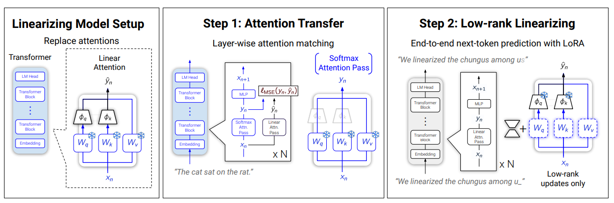

# Introduction
I write this blog to record my learning route of LLM.

# Model Structure
这是两个通过改变transformers自注意力层，从而实现计算复杂度从O(n^2)到O(n)或O(nlogn)转变的模型。他们在思路和结构上具有一定的联系。
## Mixture of Memories


总的来说，MoM模型的思想是通过一个路由器将token的topK划分到不同的专家缓存中独立进行并行的线性注意力计算，然后拼接起来。

其中的线性计算部分，也使用的是特征映射(Feature Map)

除此之外还有一个共享记忆(Shared Memory)部分

## Low-Rank Linear Conversion via Attention Transfer


另一个模型是lolcats，也是替换掉原transformers模型中的全局softmax注意力层。

通过训练线性层，并使用MSE近似它和softmax注意力的误差，这一过程叫做attention transfer。之后使用LoRA线性微调线性化后的模型 (微调注意力投影矩阵)，最小化下一词预测的交叉熵损失

ϕ是可学习的特征映射(Feature Map)，可将复杂度降到O(n)

(进阶) 使用一种滑动窗口注意力+门控线性注意力(gla)加权求和的方法作为线性注意力层。平衡效率与表达能力。滑动窗口用于捕捉局部依赖，gla用于捕捉长程依赖

# 尝试将二者结合?

需要先对比一下不同模块的功能

| 维度             | MoM（MomLinearAttention）                                                                 | lolcats（GLASlidingWindowAttention）                                  |
|------------------|-----------------------------------------------------------------------------------------|-----------------------------------------------------------------------|
| **核心思想**     | 动态路由+多专家：每个token通过门控路由到top-k个memory，每个memory独立做线性注意力，最后融合 | 滑动窗口softmax（局部）+门控线性注意力（GLA，全局），两者加权融合      |
| **稀疏性**       | token只参与top-k个memory的线性注意力，天然稀疏，专家混合                                   | 所有token都做全局GLA和滑窗softmax，无专家分组，稀疏性弱                |
| **专家机制**     | 明确的专家混合（MoE），每个memory有独立K/V投影，token分组处理                             | 没有专家分组，所有token共享参数                                       |
| **共享全局信息** | 支持shared memory（全局专家），所有token都能访问，提升全局信息流动                        | GLA本身就是全局线性注意力，所有token全局交互                          |
| **融合方式**     | 路由权重加权融合memory输出                                                                | window_factors/linear_factors加权融合滑窗和GLA输出                    |
| **线性注意力**   | 每个memory独立做线性注意力（chunk/fused等），Q/K/V投影是memory独立的                      | 全局做GLA线性注意力，Q/K/V投影全局共享                                |
| **局部建模**     | 没有滑窗softmax，主要靠专家分组和容量限制实现局部性                                       | 滑窗softmax直接建模局部依赖，GLA补充全局                              |
| **特征映射**     | 支持多种feature map（Hadamard、DPFP、ELU等），可分别用于Q/K                               | 支持多种feature map，主要用于GLA部分                                  |
| **参数量**       | 参数量大（每个memory独立K/V投影，专家数可调）                                             | 参数量相对较小（Q/K/V全局共享）                                       |
| **代码复杂度**   | 需要transform/reconstruct等复杂分组与还原逻辑，结构更复杂                                 | 结构更接近标准Transformer，主要是窗口mask和GLA融合                    |
| **适用场景**     | 超长序列、专家混合、稀疏推理、大模型                                                      | 长文本理解、局部-全局信息结合、结构简洁                               |
| **全局信息机制重合** | shared memory和GLA都能实现全局信息流动，但实现方式不同，MoM为全局专家，lolcats为全局线性注意力 | GLA为全局线性注意力，功能与MoM的shared memory有一定重合               |

---

首先可以确定的是，需要实现三个分支：
- MoM模型
- lolcat模型
- MoM与lolcat混合模型

用于进行对比消融实验
其中，混合模型中需要对比分析
shared memory和GLA全局线性注意力需要取其一还是混合使用。

# 实验部分
（之前已经跑通了MoM代码仓库中的程序）既然是在lolcat的代码上修改，第一步肯定是要先跑通lolcat的代码。

## lolcat 部署

### aladdinedu 算力平台

登陆后官网上有文档介绍如何在vscode上使用。
我们下好插件并登录后，进入workshop。

共有三个功能区 WORKSHOP、ENVIRONMENTS、TASK

- WORKSHOP: 管理开发环境，包括创建、启动、停止、删除等。
- ENVIRONMENTS: 展示可用镜像
- TASK：管理“Run task”产生的训练态任务，包括资源监控、停止、启动以及查看和下载任务日志等

跟随文档创建workshop成功后右键start进入即可。

### 测试 GPU
```python
import torch
import time

def test_cuda_availability():
    print("\n======= CUDA 测试 =======")
    # 检查 CUDA 是否可用
    cuda_available = torch.cuda.is_available()
    print(f"PyTorch CUDA 可用: {'✅是' if cuda_available else '❌否'}")

    if cuda_available:
        # 打印 CUDA 版本和设备信息
        print(f"PyTorch CUDA 版本: {torch.version.cuda}")
        print(f"当前 GPU 设备: {torch.cuda.get_device_name(0)}")
        print(f"GPU 数量: {torch.cuda.device_count()}")
    else:
        print("⚠️ 请检查 CUDA 和 PyTorch 是否安装正确！")
    print("========================\n")

def test_gpu_speed():
    print("\n======= GPU 速度测试 =======")
    # 创建一个大型张量
    x = torch.randn(10000, 10000)
    
    # CPU 计算
    start_time = time.time()
    x_cpu = x * x
    cpu_time = time.time() - start_time
    print(f"CPU 计算时间: {cpu_time:.4f} 秒")

    if torch.cuda.is_available():
        # 移动到 GPU 计算
        x_gpu = x.to('cuda')
        start_time = time.time()
        x_gpu = x_gpu * x_gpu
        torch.cuda.synchronize()  # 确保 GPU 计算完成
        gpu_time = time.time() - start_time
        print(f"GPU 计算时间: {gpu_time:.4f} 秒")
        print(f"GPU 比 CPU 快: {cpu_time / gpu_time:.1f} 倍")
    else:
        print("⚠️ GPU 不可用，跳过测试")
    print("==========================\n")

def test_training():
    print("\n======= 简单训练测试 =======")
    # 定义一个极简神经网络
    model = torch.nn.Sequential(
        torch.nn.Linear(10, 100),
        torch.nn.ReLU(),
        torch.nn.Linear(100, 1)
    )
    
    # 如果有 GPU，将模型和数据移到 GPU
    device = 'cuda' if torch.cuda.is_available() else 'cpu'
    model = model.to(device)
    print(f"使用设备: {device.upper()}")

    # 模拟数据
    X = torch.randn(1000, 10).to(device)
    y = torch.randn(1000, 1).to(device)

    # 训练循环
    optimizer = torch.optim.SGD(model.parameters(), lr=0.01)
    start_time = time.time()
    for epoch in range(5):
        optimizer.zero_grad()
        output = model(X)
        loss = torch.nn.functional.mse_loss(output, y)
        loss.backward()
        optimizer.step()
        print(f"Epoch {epoch + 1}, Loss: {loss.item():.4f}")
    
    total_time = time.time() - start_time
    print(f"总训练时间: {total_time:.2f} 秒")
    print("==========================\n")

if __name__ == "__main__":
    test_cuda_availability()
    test_gpu_speed()
    test_training()
```


### git 拉取项目, 配置环境


具体的步骤参见原github项目地址 和 相关博客

运行lolcats base版本
