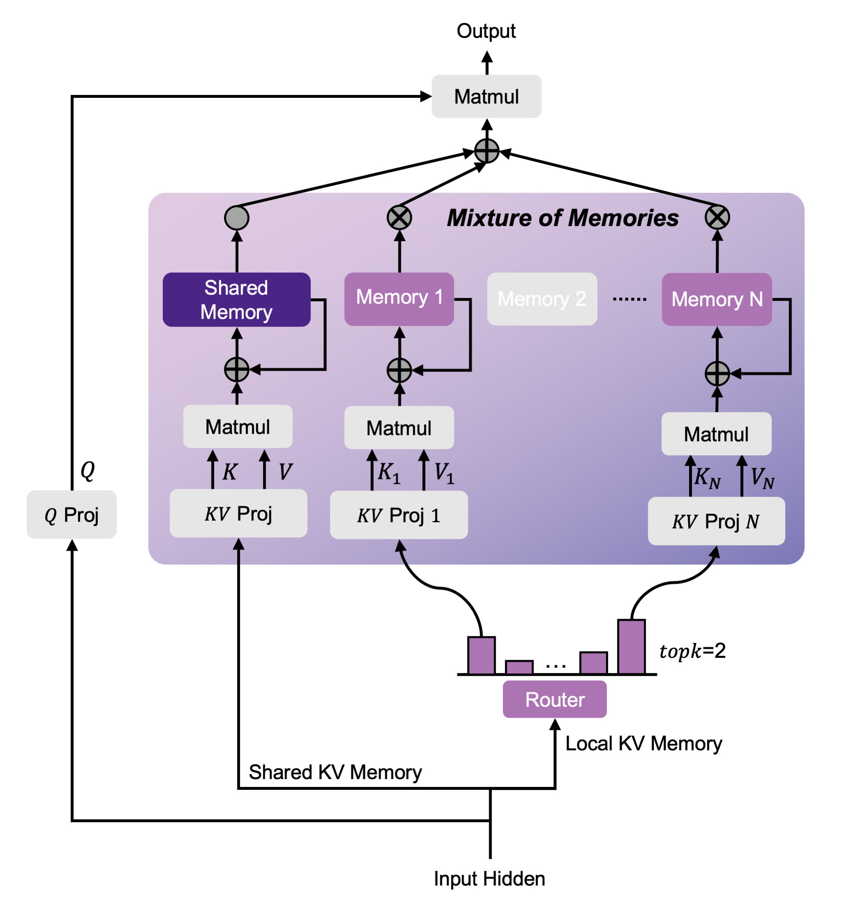

Github Source: [OpenSparseLLMs
MoM](https://github.com/OpenSparseLLMs/MoM)

Paper Source: [MoM: Linear Sequence Modeling with Mixture-of-Memories
](https://arxiv.org/pdf/2502.13685)

# Introduction
This blog is to record my learning route of LLM

# Model Structure

总的来说，MoM模型的思想是通过一个Router来对本地的K、V进行