# DR

## 第一次组会

先安排一下要做的事情：

汇报的时候需要哪些东西？

- MoM模型的运行结果（必要）
- Lolcats-linear-atten-slidingwindow-gla模型的运行结果（必要）
- 两篇论文的核心点笔记摘要（必要）
- 二者结合的思路有什么？结合的效果如何？
- Aladdin的用法
- Transformers 模型的全面学习（基础）

### Transformers

预备知识回顾：

#### RNN

Recurrent Neural Networks

神经网络NN本质上，是大量的矩阵乘法，更朴素的说，是大量的方程组 https://www.youtube.com/watch?v=UNmqTiOnRfg

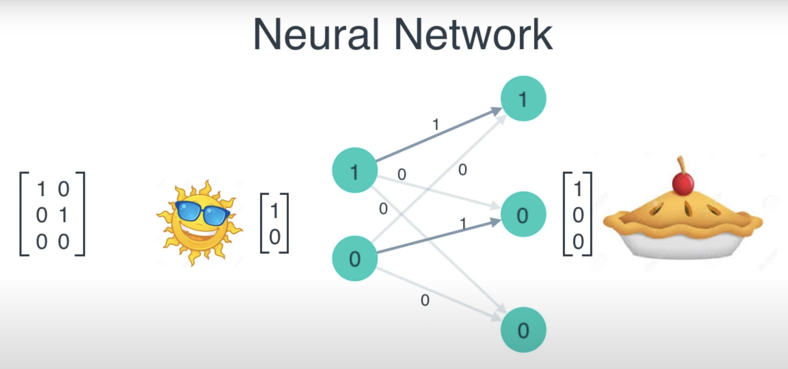

循环神经网络RNN是上一次的输出会再一次作为输入，也就是说RNN的结果是受上一次的输出影响的

根据特定的矩阵，就会形成这样的结果：或者应该理解为，

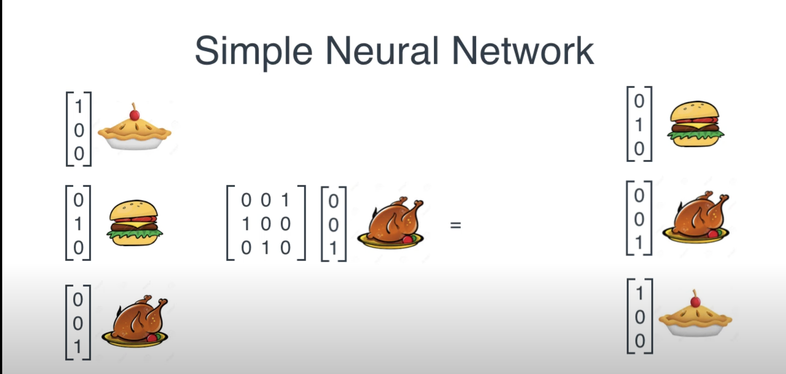

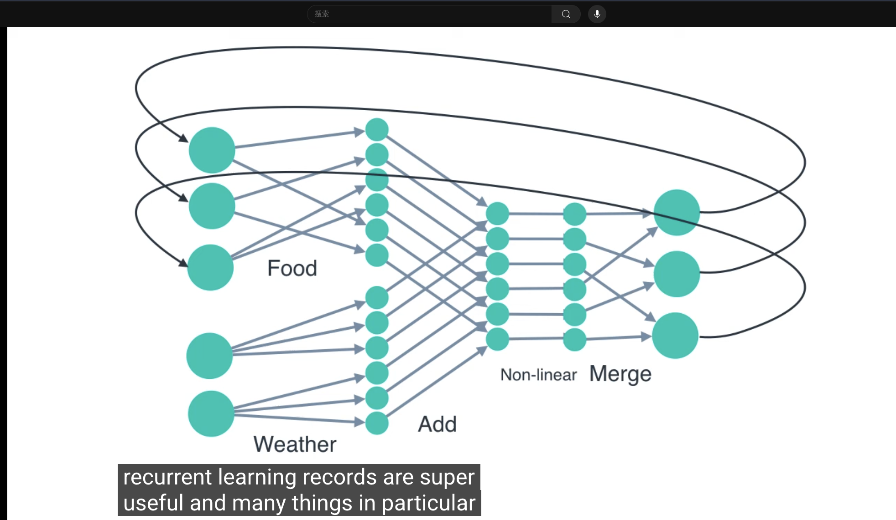

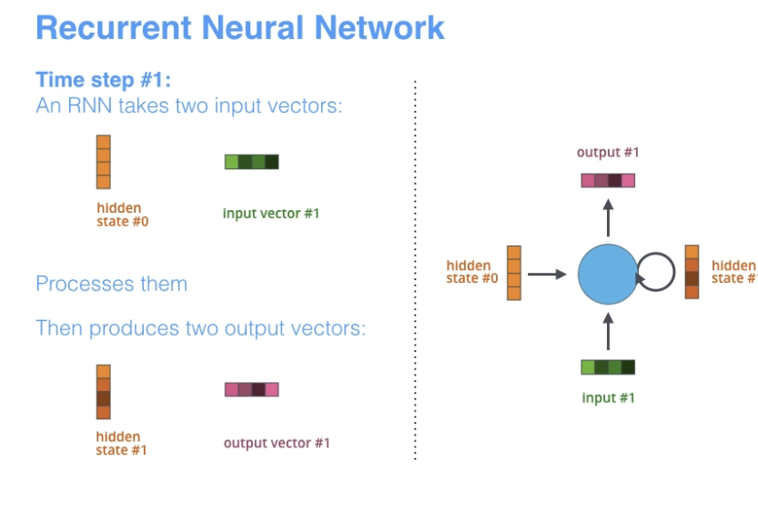

#### Seq2Seq 模型

google翻译自2016年开始使用此模型。

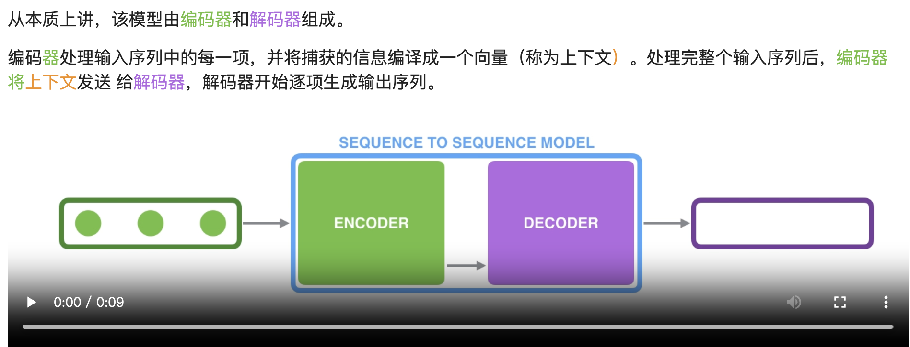

编码器和解码器通常都是循环神经网络

在编码器中：每个时间步有两个输入，一个是token（将token通过词嵌入（word embedding）的方式转换为词向量，作为RNN的输入），一个是隐藏状态。

编码器的最后一个隐藏状态，是传递给解码器的上下文context。

#### 回到transformers

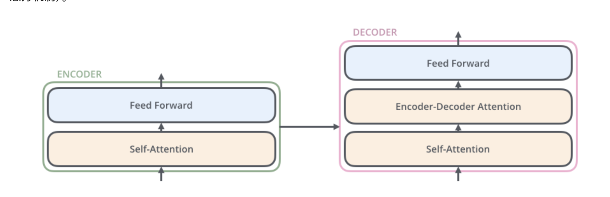

与一般的nlp一样，先将单个词转换为词向量（word embedding）

将每个词都嵌入到一个长度为==d==的向量列表中，其中==d==表示训练数据集中，最长句子的长度

##### Encoder

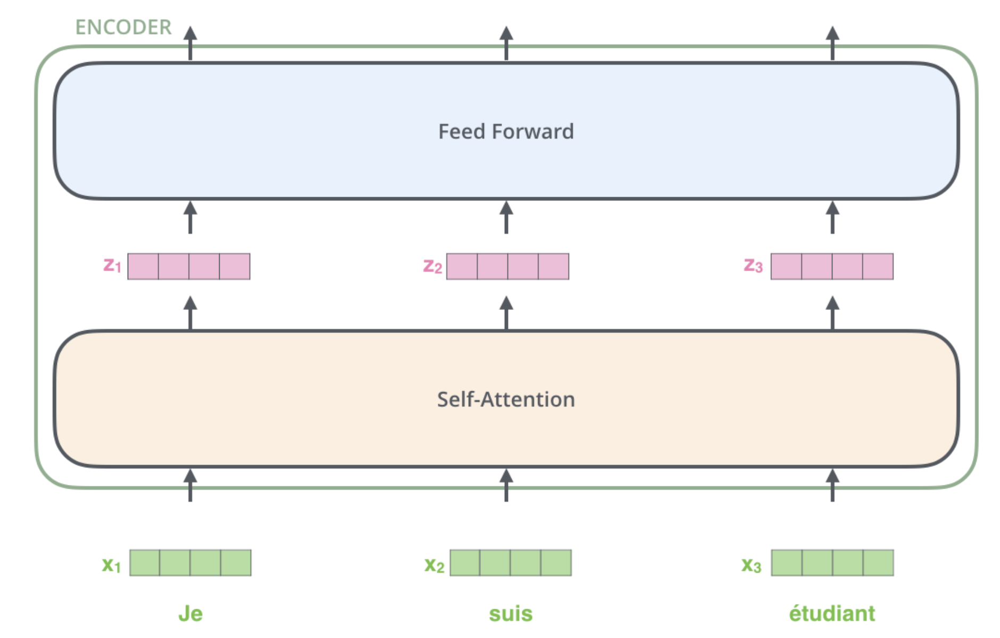

###### 自注意力机制

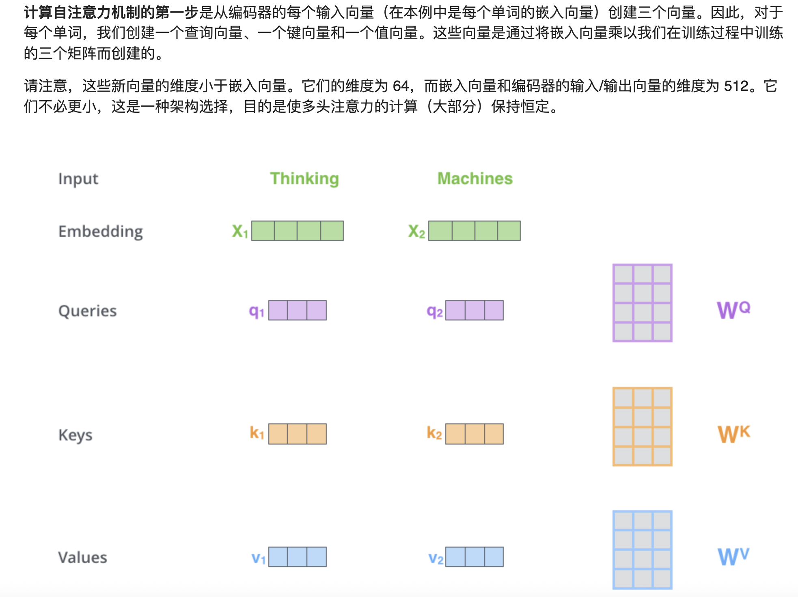

计算过程：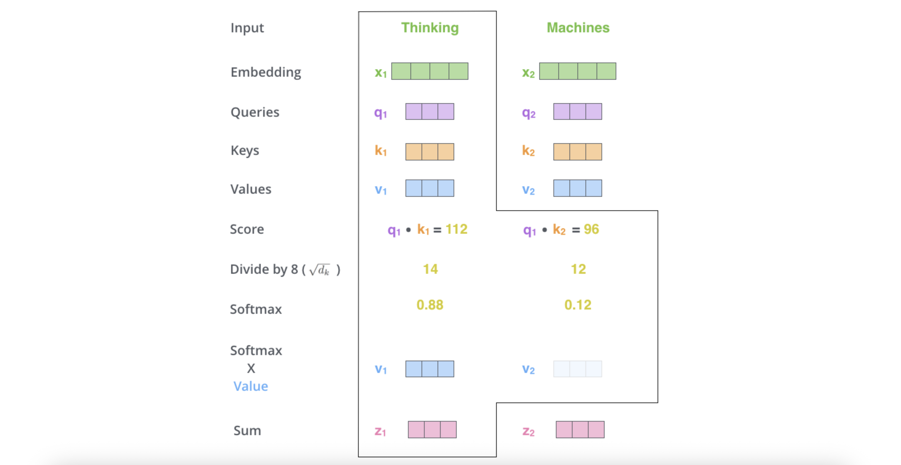

矩阵计算见：https://jalammar.github.io/illustrated-transformer/


###### 多头注意力

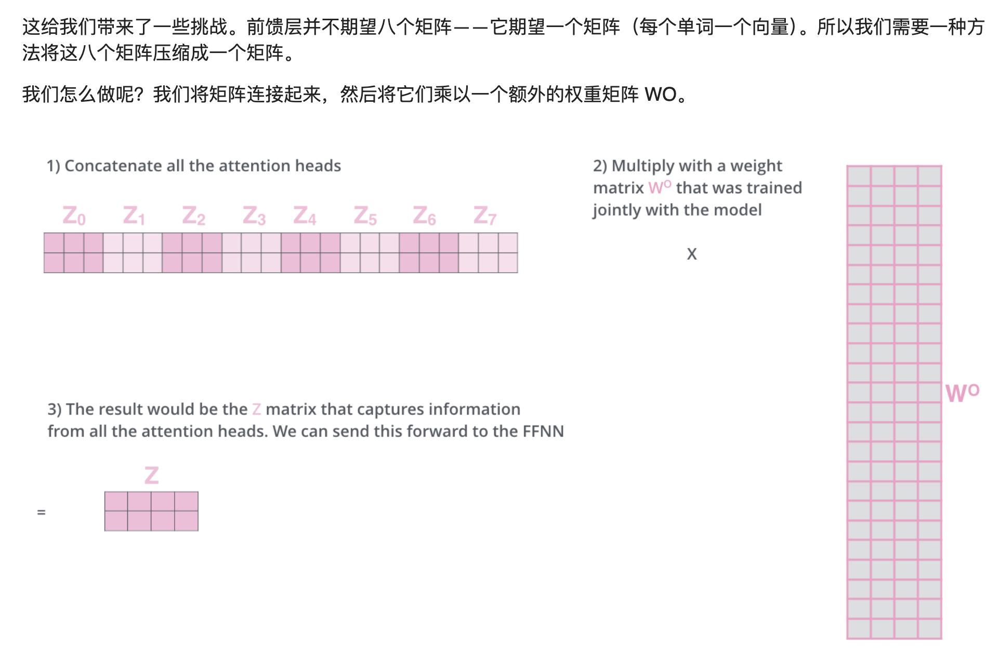

###### 位置编码

详见 链接

###### 残差

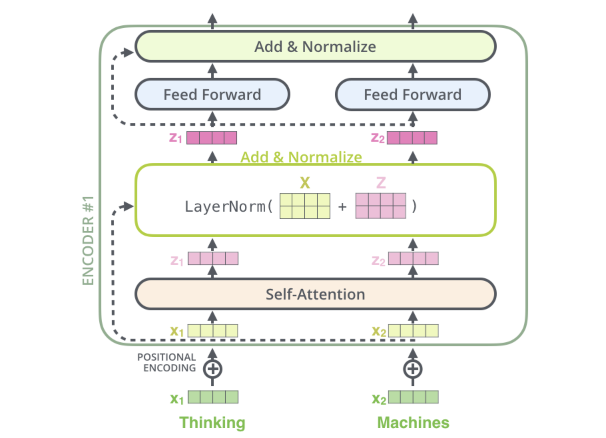

##### Decoder

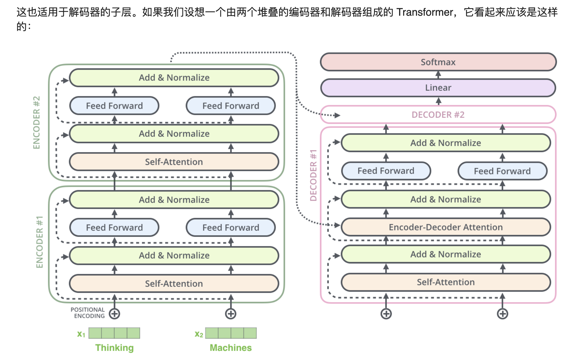

现代的GenAI / LLMs都是decoder-only的模型


### MOM

Mixture of Memories

Throughout the recurrent process, only a subset of memory states is activated and updated at each time step, while memory states that are not routed remain inactive and unchanged. When the input passes through the key-value projection layer, it generates multiple sets of keys and values that are fed into different memory modules. This design enables the model to maintain multiple memory states, each preserving distinct pieces of information. By aggregating the activated memories into a comprehensive mixed memory by weighted summation, the query can effectively retrieve information from this mixed memory, which results the "attention output" followed by other layers.

在整个循环过程中，每次时间步长只有部分记忆状态被激活和更新，而未被路由的记忆状态则保持不活跃且不变。当输入通过键值投影层时，它会生成多组键和值，这些键值被输入到不同的记忆模块中。这种设计使模型能够维持多个记忆状态，每个状态保存不同的信息。通过加权求和将激活的记忆聚合为一个综合的混合记忆，查询能够有效地从这个混合记忆中检索信息，从而产生“注意力输出”，然后传递给其他层。

### LLMs术语

**340M Params 15B Tokens L=24, d=1024**的意思是：

模型的参数量是3.4亿（层数、隐藏维度、embedding大小等），反应模型容量

训练时，使用的总token数是150亿，也就是说模型看过150亿个文本token，反应数据规模

L：表示模型的层数（深度）是24

==d==：表示每一层的隐藏维度hidden size是1024（对应embedding向量、前馈层、注意力的维度）

PPL: perplexity 困惑度，衡量模型对一段文本预测能力的指标。1～k, 越低模型越好

MMLU：知识问答

Alignment对齐：SFT（监督微调）、PPO（近端策略优化）、DPO（直接策略优化）、RLHF（人类反馈强化学习）

SFT: supervised Fine-Tuning：

PEFT: parameter-efficient-Fine-Tuning : 帮助**高效微调**，避免全量参数更新，节省显存和计算量

### LoLCATs

LoRA在什么模型上的调优效果都不错，但是不够泛化，换一个应用场景，模型性能依旧不好。后面可能会换掉


任务1：
MoE、sliding window

千问3 MoE dislation (这个) 和 gemma3 

apacha clean数据集

Cache \ dataset 放到data3：os.home()

复线 gla的结果 


任务2: 加MoM


初步环境配置完毕 

python : 3.10

torch: 2.6.0 cu118

transformers : 4.56.1

flash-atten : 2.7.3

fla : 0.3.1 (含mom实现)

遇到的问题：

1. transformers 4.56.1 版本问题导致的：

   1. ImportError: cannot import name 'LLAMA_INPUTS_DOCSTRING' 

   ​       from 'transformers.models.llama.modeling_llama'

   ​        新版transformers把这个字段删去了，要去代码里修改一下：注释掉 ==modeling_llama.py 第32行, 58行== 

   2. ==Linear_attention.py 第232行== init_weights() 提示找不到hidden_size等属性，之后发现新版transformers等这些属性需要多加一个config

   3. ==Linear_attention.py 第269行==  同上，这里原代码访问base_attn.rotary_emb，但是新版tramsformer没有，相应属性在config里，开头定义过。一些rotary_emb的参数，改成了固定的常数值。

   4. 新版transformers的rope_scaling_type用了新的字段：llama3, 而==rotary.py==中并没有定义，加了一下llama3的实现：==第62行==

      (目前没有用，因为代码原本用的是None) 不走这个分值

   5. ==rotary.py 第187行==，if seq_len > self.max_seq_len_cached:报错，提示seq_len存在tensor和int的模糊定义

   6. 

   7. 

2. 路线修改：这种一个一个改的办法，太慢且太workout了，学长提供的新思路：

   Steps：

   1. modeling_llama.py（这样就可以通过对照解决版本不兼容的问题）
      1. Compare modeling_llama.py (lolcats, lawcat) – simple
      2. Compare modeling_llama.py (lolcats, transformers v4.43) – main
      3. Apply similar modifications on transformers latest.
   2. Fla
      1. Add recurrent state qk in fla/models/[utils.py](http://utils.py) like the file in appendix
   3. modeling_gemma3/[qwen3.py](http://qwen3.py)
   4. Replace GLA with MoM


==Task1: lolcats 和 lawcats==

1. 三个新导入的包 （两个在注释里没用上），get_attention_cache主要用途是 服务新的 KV state cache
2. lolcatsllamamodel的forward中，多定义了一个==cur_steps，用于sliding_window的状态更新==
3. past_key_values.get_usable_length(seq_length) 改成了 past_key_values.get_seq_length(seq_length)
4. Casual_mask 设置为了 None，==lawcats中注意力不是标准softmax因果掩码，可能是通过 linear/sliding window attention 内部实现因果性==
5. LolcatsLlamaForCausalLM的forward中，多加了一个logits_to_keep: Optional[int] = 0的传入参数（调用注释掉了）
6. 获取pretraining_tp的方式变了


==Task2: lolcats和transformers v4.43==  变动很大，好多代码进行了删除

1. llamamodel类：
   1. lolcatsllamamodel类，从llamamodel类继承，在这之前只留一个logger
   2. if use cache: 进行了修改
   3. 删去了_update_causal_mask()函数
2. lolcatsForCausalLm类： 自回归语言模型
   1. 名字
   2. 初始化加了三个config变量
   3. outputs = self.model()变量从外部传入的，上面的forward也是
3. 多写了一个lolcatsFor CausalLm的子类：LooooocatsForCausalLm
4. 问答和后面的一些功能类都删去了


==LlamaModel==负责将输入向量化、RoPE，Decoder，最终输出hidden_states

==ForCausalLM==调用LlamaModel，将得到的hidden_states输入linear层，投影到vocab_size维度，得到logits (预测词分布)，最后进行“下一词预测“


关于 meta_device的问题，在加载模型时，就出现了，证明是模型太大的原因

试了llama3_8B的模型，都没有问题。


对于目前的Qwen/Qwen3-30B-A3B-Instruct-2507模型(MoE)，由于模型较大，需要60GB左右的显存，实验室的A6000 48GB的需要使用多卡分布式训练。但是多卡训练遇到了这样的报错：

```
full_nargs = {**self.nargs, **kwargs, **self.cache[key].all_kwargs()}
TypeError: 'NoneType' object is not a mapping
```

目前认为是多GPU的导致backward时出现的问题

1. 用显存更大的卡跑
2. 分布式多GPU学习

==后续：是的，在多张卡上训练，导致backward过程出错，需要分布式技巧==，可能要使用==Megatron==


暂时转战： allenai/OLMoE-1B-7B-0125-Instruct 的小模型，跑出结果，加上微调和测评，gla中加上fla的mom再跑一次


需要注意的是，OLMoe和Qwen3Moe都在Q，K投影后进行了一次Norm，gla中需要进行类似的操作


## 任务大纲

Distillation For Linear Attention

1. Target model:

   a. LAWCAT for MoE model like: Qwen/Qwen3-30B-A3B-Thinking-2507

​		allenai/OLMoE-1B-7B-0125-Instruct

​	b. LAWCAT for hybrid (FA + SWA) model like: google/gemma-3-1b-it

2. Dataset:

   1. yahma/alpaca-cleaned

   2. Input length: 1024

3. Benchmark:

   1. LM Eval

   1. Baseline:
      1. LoLCATs
      2. LAWCAT

4. Others:

   1. Current codebase is based on LoLCATs and only compatible with old transformers version, need to make changes in src/model/modeling_llama.py or other related part

   1. After this modification, run a checking exp (with both distillation and lora ft on LoLCATs (you may need to copy the model config from the original repo) or LAWCAT) and compare the results to make sure the modification is correct.

   1. After the confirmation, add the MoM, and check the results of only applying distillation

   1. Note: set the HF_HOME to a folder in /data3 in our server, and also save all the checkpoint in /data3

5. Steps (Old)

   1. modeling_llama.py
      1. Compare modeling_llama.py (lolcats, lawcat) – simple
      2. Compare modeling_llama.py (lolcats, transformers v4.43) – main
      3. Apply similar modifications on transformers latest.

   1. Fla

      1. Add recurrent state qk in fla/models/[utils.py](http://utils.py) like the file in appendix
      2. modeling_gemma3/[qwen3.py](http://qwen3.py)

      3. Replace GLA with MoM

6. Steps (New, update 9/18/2025, use llama as an example)
   1. modeling_xxx.py
      1. Copy the modeling_xxx.py from the latest transformer library of the target model (like qwen3_moe or gemma3)
      2. Define: class LolcatsLlamaModel(LlamaModel) and add _can_record_outputs = { "hidden_states": LlamaDecoderLayer, "attentions": LolcatsLinearAttention}
      3. Change the definition of past_key_values [does not affect the training]
   2. src/model/linear_attention/linear_attention.py
      1. This file need to copy weights of original layers into new attention class
      2. May need to add more if conditions to make it handle models with different layer names
   3. src/model/linear_attention/linear_window_attention_sw_gla.py
      1. I have changed it for new version of transformers library, the main changes it is the part related to RoPE
      2. You should apply similar modifications to src/model/linear_attention/linear_window_attention_sw.py
      3. It should be slightly more difficult, check and compare the original implementation in lolcats github
   4. Results:
      1. GLA (Distill + LoRA FT) 
      2. LoLCATs (Distill + LoRA FT)
      3. MoM (Distill + LoRA FT)
7. Reference
   1. [LoLCATs](https://github.com/HazyResearch/lolcats)
   2. [MoM: Linear Sequence Modeling with Mixture-of-Memories](https://arxiv.org/abs/2502.13685)
   3. [Hymba: A Hybrid-head Architecture for Small Language Models](https://openreview.net/forum?id=A1ztozypga)
   4. [A Systematic Analysis of Hybrid Linear Attention](https://arxiv.org/pdf/2507.06457)

## 目前的问题

1. GLA的实验，distill_train和distill_eval的loss过低

2. GLA的final_eval 报错，关于past_key_values的数据格式：

   TypeError: tuple indices must be integers or slices, not str

3. LOLCATS的实验


已解决，有了OLMoE的三组基础实验:

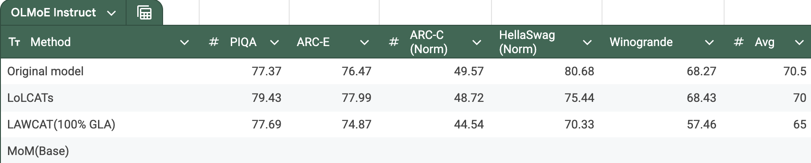

Gla(线性注意力) 相比于 lolcats(传统attnetion) 的优点：

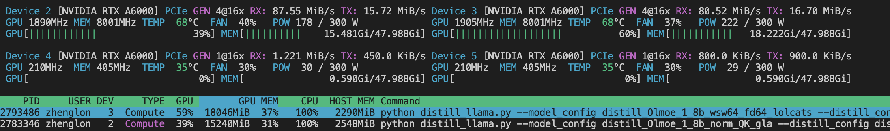

可以看出，在节省了50%算力和17%显存的情况下，平均正确率只下降了8%

# 11.08任务

将base_atten换成MoM（Baseline for MoM）：

## 传入参数

(Pdb) base_attn
OlmoeSdpaAttention(
  (q_proj): Linear(in_features=2048, out_features=2048, bias=False)
  (k_proj): Linear(in_features=2048, out_features=2048, bias=False)
  (v_proj): Linear(in_features=2048, out_features=2048, bias=False)
  (o_proj): Linear(in_features=2048, out_features=2048, bias=False)
  (q_norm): OlmoeRMSNorm((2048,), eps=1e-05)
  (k_norm): OlmoeRMSNorm((2048,), eps=1e-05)
)
(Pdb) model_config
{'name': 'olmoe', 'model': {'pretrained_model_name_or_path': 'allenai/OLMoE-1B-7B-0125-Instruct', 'cache_dir': '/data3/zhenglon/huggingface/transformers', 'return_dict': True, 'load_in_8bit': False, 'load_in_4bit': False, 'device_map': 'auto', 'low_cpu_mem_usage': True, 'dtype': 'bfloat16', 'attn_implementation': 'sdpa', 'rope_theta': 10000.0}, 'attention': {'attention_type': 'mom', 'num_memories': 4, 'topk': 2, 'shared_mem': True, 'single_kv_proj': False, 'use_short_conv': True, 'conv_size': 4, 'conv_bias': False, 'use_output_gate': True, 'mode': 'chunk', 'expand_v': 2.0, 'learned_kernel_kwargs': {'zero_init': True}, 'feature_map_kwargs': {}, 'learned_kernel': None, 'tie_qk_kernels': None, 'train_qk': None, 'state_chunk_len': None, 'no_peft_grad_ckpt': None, 'window_size': None, 'sink_size': None, 'rank': 0}}


### 当前任务

继承lolcats_linear_attention(✅)


forward下，写gla+win的两种调用（norm不要写在这里，封装斤process_qkv）找到这俩可以共享的部分(✅)


win_attn内部可以直接用4维(✅)


Global_vars 传需要的参数(✅)


conv部分，多大几个断点，可能会因为cuda报错


shared：对v不用conv ==(待做)==


conv之后，加一下feature_map(396行，sw_gla) 加在mom的233行==(待做)==


先跑share_kv的，记录一下trainable_para的百分比==(待做)==


g, beta  消融share or not==(待做)==

share_mem 是否需要==(待做)==


---

Default_lm.py: line 70

Load_model_for_eval.py: line 285

distill_attention_xent_mse.py: line 98(105) 应该是使用了更general的写法（模型内的输出）

fla的版本要用0.3.2的

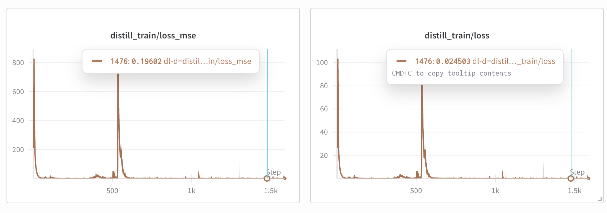

存在数值不稳定的情况，即训练中途出现“尖峰”，在g的计算中，加入了数值钳位(torch.clamp)，之后，尖峰仍然存在，但是数值上有了明显的缓解（一半）。现在给o_proj加了init_weight_zero，结合torch.clamp，训练的数值平稳了很多。

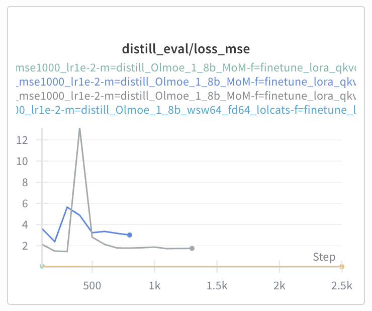

看看后面有checkpoint后，ft效果如何。--> ==这些矩阵的权重，base有的要用base的==，不能直接定义新的，不然差的太多了。继承base_attn后，loss图像和gla的几乎一致。


另外，fintune的部分报错，好像是因为用了modulelist的缘故, 修改了ft_config里的target_modules：目前只对非modulelist的矩阵进行LoRA微调，第一次蒸馏的checkpoint错的离谱，ft的ppl有200万。大概率是因为ditstill的checkpoint不对。


关于之前==qwen3-30B太大==无法放入单张卡训练的问题，或许可以使用==Megatron==（NVIDIA Megatron-LM）威震天，它是一个超大规模模型训练框架（参数量达到数百亿甚至万亿级别）。它可以==模型并行== (Model Parallelism)，将矩阵切分，放在多个GPU上，实现高效张量并行，https://github.com/huggingface/peft/blob/main/tests/test_lora_megatron.py是peft的Megatron兼容版本。


目前要跑的实验：

share_kv的trainable百分比

非share_kv的的trainable百分比

g, beta  消融share or not==(待做)==

share_mem 是否需要==(待做)==

|   实验 ID    | Share KV | share$ g$ | Share $\beta$ | Share Mem |      Trainable %       | Loss | PPL  |           备注            |
| :----------: | :------: | :-------: | :-----------: | :-------: | :--------------------: | :--: | :--: | :-----------------------: |
| **Baseline** |    ❌     |     ❌     |       ❌       |     ✅     | **0.968% **0.073/7.53B | 最低 |      | single_kv=0, shared_mem=1 |
|  **Exp 1**   |    ❌     |     ❌     |       ❌       |     ❌     | **0.954%** 0.072/7.53B |      |      | single_kv=0, shared_mem=0 |
|  **Exp 2**   |    ✅     |     ✅     |       ✅       |     ✅     | **0.983%** 0.069/6.99B |      |      | single_kv=1, shared_mem=1 |
|  **Exp 3**   |    ✅     |     ✅     |       ✅       |     ❌     | **0.983%** 0.069/6.99B |      |      | single_kv=1, shared_mem=0 |
|  **Exp 4**   |          |           |               |           |                        |      |      |                           |
|  **Exp 5**   |          |           |               |           |                        |      |      |                           |
|              |          |           |               |           |                        |      |      |                           |

q默认都是share的

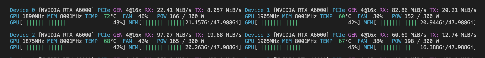

